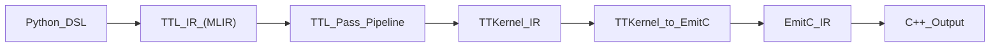

# Архитектура TT-Lang — Низкоуровневый дизайн: Компиляционный пайплайн

## 0. Метаданные

- **Статус**: Актуально (LLD).
- **Аудитория**: разработчики passes/pipelines, maintainers `ttlang-opt`/`ttlang-translate`.
- **Зачем читать**: понять, где задается pipeline, какие границы стадий, и где добавлять новые преобразования/тесты.
- **Связанные документы**:
  - `docs/01_Architecture/01_HighLevelDesign.md` (ответственности и инварианты)
  - `docs/01_Architecture/05_LLD_Testing.md` (архитектура тестов)
  - `docs/BUILD_SYSTEM.md` (сборка и toolchain)

## 1. Назначение

Этот документ детализирует компиляционный пайплайн tt‑lang: от Python DSL к TTL IR, далее к TTKernel/EmitC и к C++ артефактам. Документ “приземляет” High‑Level дизайн на конкретные файлы и точки расширения.

## 2. Артефакты и стадии (L1)

Ниже — логическая последовательность стадий (не обязательно 1:1 по бинарям):

## 3. Где задаётся пайплайн

- TTL pipeline: `lib/Dialect/TTL/Pipelines/TTLPipelines.cpp`
  - регистрирует pipeline `ttl-to-ttkernel-pipeline` (см. `registerTTLPipelines()`).
- Трассировка примера multi‑tile lowering: `docs/LOWERING_MULTITILE.md`

### 3.1 Текущий pipeline `ttl-to-ttkernel-pipeline` (порядок и гарантия стадий)

Источник истины: `lib/Dialect/TTL/Pipelines/TTLPipelines.cpp` (функция `createTTLToTTKernelPipeline()`).

**Порядок passes (сверху вниз)**:

1) `convert-ttl-to-compute` (`createTTLConvertTTLToCompute()`)
2) `ttl-assign-dst` (`createTTLAssignDST()`)
3) `ttl-insert-tile-regs-sync` (`createTTLInsertTileRegsSync()`)
4) `ttl-lower-to-loops` (`createTTLLowerToLoops()`)
5) `ttl-annotate-cb-associations` (`createTTLAnnotateCBAssociations()`)
6) `convert-ttl-to-ttkernel` (`createTTLConvertTTLToTTKernel()`)
7) `canonicalize`
8) `cse`
9) (опционально, если `lower-to-emitc=1` в опциях pipeline):
   - `lower-affine`
   - `ttkernel-to-emitc` (`::mlir::tt::createConvertTTKernelToEmitC()`)
   - `canonicalize`
   - `emitc-form-expressions`

**Почему порядок важен (инварианты и зависимости)**:

- `ttl-assign-dst` и `ttl-insert-tile-regs-sync` должны выполняться **до** lowering в TTKernel и строго в этом порядке. Это является архитектурным контрактом pipeline: assignment формирует атрибуты/вставки, а sync-стадия вставляет жизненный цикл (acquire/commit/wait/release) вокруг использования DST.
- `ttl-lower-to-loops` переводит compute-часть к структурированным циклам (`scf.*`), чтобы downstream lowering работал на канонической форме control flow.
- `ttl-annotate-cb-associations` фиксирует связи операций с circular buffers (архитектурно: эти связи должны стать явными до TTKernel).
- `canonicalize`/`cse` считаются "cleanup" стадией, которая не должна менять семантику, но может менять форму IR (поэтому тесты должны проверять инварианты, а не случайный порядок строк).

## 4. Ключевые passes (TTL)

Набор “опорных” пасов, которые обычно встречаются в pipeline (точные пайплайны могут отличаться):

| Pass | Роль | Код |
|---|---|---|
| `convert-ttl-to-compute` | перевод tensor‑ops в `ttl.compute` регионы | `lib/Dialect/TTL/Transforms/ConvertTTLToCompute.cpp` |
| `ttl-assign-dst` | аллокация DST и вставка `ttl.copy_tile` (когда нужно) | `lib/Dialect/TTL/Transforms/TTLAssignDST.cpp` |
| `ttl-insert-tile-regs-sync` | синхронизация/жизненный цикл DST regs | `lib/Dialect/TTL/Transforms/TTLInsertTileRegsSync.cpp` |
| `ttl-lower-to-loops` | lowering compute к `scf.for` | `lib/Dialect/TTL/Transforms/ConvertTTLComputeToSCF.cpp` |
| `convert-ttl-to-ttkernel` | lowering TTL ops к TTKernel ops | `lib/Dialect/TTL/Transforms/ConvertTTLToTTKernel.cpp` |

Примечание: порядок и набор зависит от конкретного pipeline (см. `TTLPipelines.cpp`).

## 5. Минимальный walkthrough по границам IR (псевдо-MLIR)

Цель секции - показать не точные имена всех ops, а **границы формы** и **инварианты**, которые должны выполняться после каждой стадии.

### 5.1 До pipeline: TTL IR (концептуально)

Ожидаемая форма (примерно):

- kernel содержит зарегистрированные thread regions (compute/datamovement),
- compute часть выражена через TTL ops и/или `ttl.compute` регионы,
- данные представлены tile/tensor-типами, а требования по DST/CB еще не полностью материализованы.

### 5.2 После `ttl-assign-dst` + `ttl-insert-tile-regs-sync`

Инварианты:

- все значения, требующие DST, имеют согласованное назначение (например, атрибуты `dst_idx` или эквивалент),
- добавлены операции жизненного цикла DST (acquire/commit/wait/release) вокруг критических участков,
- добавлены необходимые копии (`copy_tile` и т.п.) для block args / multi-consumer значений, чтобы сохранить корректность dataflow.

### 5.3 После `ttl-lower-to-loops`

Инварианты:

- compute регион находится в структурированном control flow (`scf.for` и т.п.),
- дальнейшие lowering passes не должны зависеть от Python-специфичных конструкций.

### 5.4 После `convert-ttl-to-ttkernel`

Инварианты:

- TTL ops больше не присутствуют (или присутствуют только как "маркеры", если это отдельная политика),
- IR выражен в терминах TTKernel диалекта (tt-mlir),
- дальнейшая трансляция (включая optional EmitC) является функцией только TTKernel IR.

## 6. Драйверы инструментов (CLI)

- `ttlang-opt`: `tools/ttlang-opt/ttlang-opt.cpp`
  - MLIR opt‑драйвер (регистрирует диалекты и TTL pipelines, затем вызывает `MlirOptMain`).
- `ttlang-translate`: `tools/ttlang-translate/ttlang-translate.cpp`
  - MLIR translate‑драйвер (включая регистрацию `--ttkernel-to-cpp`).

Примеры (как “payload”):

- TTL -> TTKernel:
  - `ttlang-opt --ttl-to-ttkernel-pipeline --canonicalize input.mlir -o out.ttkernel.mlir`
- TTL -> EmitC (через опцию pipeline):
  - `ttlang-opt --ttl-to-ttkernel-pipeline="lower-to-emitc=1" input.mlir -o out.emitc.mlir`
- EmitC/TTKernel -> C++:
  - `ttlang-translate --ttkernel-to-cpp -o out.cpp out.emitc.mlir`

## 7. Типовые ошибки и где они возникают

### 6.1 Verification/Legality ошибки

Симптомы:

- “failed to legalize operation …”
- “verification failed …”

Где смотреть:

- конверсия/легализация: `lib/Dialect/TTL/Transforms/ConvertTTLToTTKernel.cpp`
- тесты преобразования: `test/ttlang/Conversion/`

### 6.2 Ошибки трансляции (TTKernel/EmitC -> C++)

Симптомы:

- “unsupported op …”
- “translation failed …”

Где смотреть:

- `ttlang-translate` + связанные переводчики
- тесты `test/ttlang/Translate/TTLToCpp/`

## 8. Точки расширения (как развивать)

- Добавить новый pass:
  - объявление/регистрация в соответствующем `Passes.td` (если используется TableGen паттерн),
  - реализация в `lib/Dialect/.../Transforms/`.
- Добавить pipeline:
  - в `lib/Dialect/TTL/Pipelines/TTLPipelines.cpp`.
- Добавить тест:
  - `test/ttlang/Conversion/*` или `test/ttlang/Translate/*`.
