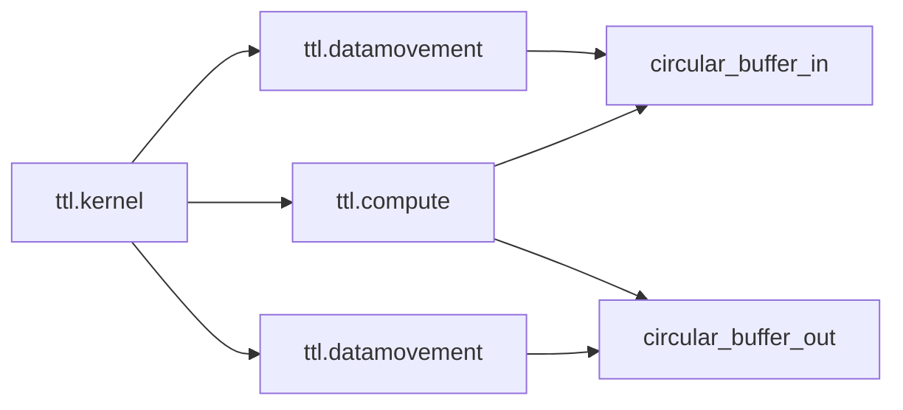
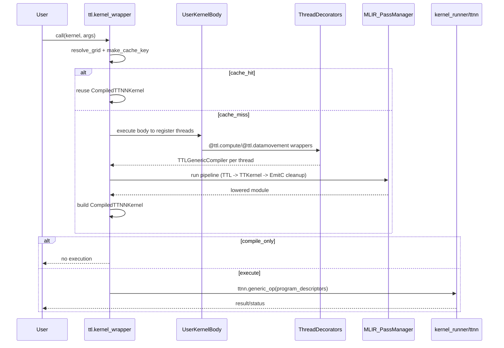

# Архитектура TT-Lang — Низкоуровневый дизайн: Runtime и Python API

## 0. Метаданные

- **Статус**: Актуально (LLD).
- **Аудитория**: разработчики Python frontend и runtime-интеграции (`ttnn`), а также авторы DSL kernels.
- **Что считается "runtime" в рамках этого документа**: Python-слой подготовки/запуска и его контракт с `ttnn`/устройством; не низкоуровневый runtime tt-metal.
- **Связанные документы**:
  - `docs/01_Architecture/01_HighLevelDesign.md` (границы ответственности)
  - `docs/01_Architecture/02_LLD_CompilerPipeline.md` (MLIR pipeline)
  - `docs/01_Architecture/04_LLD_Simulator.md` (симуляция)
  - Языковая спецификация: `docs/sphinx/specs/TTLangSpecification.md`

## 1. Назначение

Этот документ описывает Python‑слой tt‑lang: DSL API, компиляцию из Python и (в общих терминах) запуск на устройстве или в симуляции.

## 2. Ключевые модули и точки входа

- Python API ядра: `python/ttl/` (основной пользовательский слой)
- Главная спецификация языка и терминов: `docs/sphinx/specs/TTLangSpecification.md`

Типовой вход:

- `@ttl.kernel()` — kernel‑функция (принимает `ttnn.Tensor`, возвращает `None`)
- `@ttl.compute()` и `@ttl.datamovement()` — thread‑функции внутри kernel

### 2.1 Карта модулей (что где находится)

| Модуль | Роль (архитектурно) |
|---|---|
| `python/ttl/__init__.py` | Экспортирует публичный DSL API на уровень пакета, чтобы работало `import ttl; ttl.kernel`. |
| `python/ttl/ttl.py` | "Единый namespace" `ttl.*`: декораторы, CB helpers, операторы, math namespace. |
| `python/ttl/ttl_api.py` | Основная реализация декораторов (`pykernel_gen`, `compute`, `datamovement`), сбор thread-функций, компиляция в MLIR, запуск pass pipeline, кэш компиляции. |
| `python/ttl/diagnostics.py` | Форматирование ошибок с привязкой к исходникам (Rust/Swift-style). |
| `python/ttl/circular_buffer.py` | Модель CircularBuffer в DSL, назначение индексов CB, сбор конфигураций. |
| `python/ttl/kernel_runner.py` | Конверсия артефактов компиляции в `ttnn.generic_op` descriptors и запуск на устройстве. |
| `python/ttl/operators.py` | Высокоуровневые примитивы DSL (copy/core/grid_size и др.). |

## 3. Модель исполнения (логически)

Внутри kernel задаются thread‑функции (compute / datamovement), которые используют примитивы:

- circular buffers,
- семафоры,
- blocks/pipes (более высокоуровневые абстракции над layout/коммуникацией).

### 3.1 Жизненный цикл вызова `ttl.kernel` (компиляция + выполнение)

Архитектурно `ttl.kernel()` возвращает wrapper, который при каждом вызове:

- разрешает `grid` (значение или callable),
- строит ключ кэша компиляции из свойств `ttnn.Tensor` аргументов,
- при необходимости компилирует kernel в MLIR и далее в артефакты для `ttnn.generic_op`,
- выполняет kernel (если не включен compile-only режим).

Схема (упрощенно):

### 3.2 Кэш компиляции (что считается "одинаковым" вызовом)

В текущей реализации кэш находится внутри wrapper'а, который возвращает `pykernel_gen()`:

- **Гранулярность**: кэш "на декоратор" (на одну kernel-функцию) и живет в памяти процесса.
- **Ключ кэша**: набор свойств `ttnn.Tensor` аргументов, влияющих на lowering (shape/dtype/memory_space/layout).
- **Следствие**: если входные tensors меняют shape/dtype/layout, будет выполнена перекомпиляция.

## 4. Артефакты компиляции и отладки

Важная практическая часть — возможность:

- сохранять промежуточный IR,
- видеть пайплайн пасов,
- воспроизводить проблему на минимальном тесте.

Связанные темы:

- `docs/LOWERING_MULTITILE.md` — пример “Python -> MLIR -> C++” трассировки

### 4.1 Наблюдаемость в текущей реализации (что реально доступно)

- `verbose` в `ttl.compute(verbose=...)` / `ttl.datamovement(verbose=...)` печатает AST/MLIR в ходе компиляции thread-функций (см. `python/ttl/ttl_api.py`).
- Для “сквозной” отладки структуры lowering удобнее использовать `docs/LOWERING_MULTITILE.md` и воспроизводить pipeline через `ttlang-opt`.

Также доступны переменные окружения, которые читаются напрямую из `os.environ` в `python/ttl/ttl_api.py`:

- `TTLANG_COMPILE_ONLY=1`: компилировать, но не выполнять.
- `TTLANG_DEBUG_LOCATIONS=1`: печатать locations в MLIR output.
- `TTLANG_INITIAL_MLIR=/path`: сохранить начальный IR перед pipeline.
- `TTLANG_FINAL_MLIR=/path`: сохранить финальный IR после pipeline.
- `TTLANG_VERBOSE_PASSES=1` (или непусто): печать IR до/после passes.

## 5. Контракт с `ttnn` (граница ответственности runtime)

Текущий runtime слой tt-lang использует `ttnn.generic_op` и строит для него дескрипторы:

- kernel descriptors (пути к C++ kernel источникам, compile-time/runtime args),
- CB descriptors (размеры/форматы circular buffers),
- program descriptor.

Источник истины: `python/ttl/kernel_runner.py`.

**Ключевой дизайн-вывод**: tt-lang не пытается "выполнить" IR сам по себе; он подготавливает артефакты так, чтобы `ttnn` мог выполнить программу на устройстве (или выбросить диагностируемую ошибку, если устройство/окружение недоступны).

## 6. Ограничения DSL и валидации (минимальный перечень)

Ниже перечислены ограничения, которые уже явно зафиксированы в Python слое (и поэтому являются частью текущего поведения):

- `ttl.kernel(grid=...)`: параметр `grid` обязателен (иначе `ValueError`).
- Внутри kernel должна быть определена хотя бы одна thread-функция: `@ttl.compute()` или `@ttl.datamovement()` (иначе `ValueError: No threads found...`).
- `num_outs` в текущей реализации поддерживает только значение `1` (валидация в `KernelDecoratorOptions`).
- `memory_space` ограничен набором `SUPPORTED_MEMORY_SPACES` (валидация в `KernelDecoratorOptions`).
- Если заданы `iterator_types`, должны быть заданы `indexing_maps`, и их размерности должны совпадать (валидация в `KernelDecoratorOptions`).

Замечание: более широкие ограничения DSL (какие Python конструкции разрешены/запрещены) должны быть описаны в `docs/sphinx/specs/TTLangSpecification.md` и поддержаны diagnostics в `python/ttl/diagnostics.py`.

## 7. Ошибки (типовые) и обработка

### 7.1 Ошибки ограничений DSL

Симптомы:

- пользовательская функция использует неподдерживаемый Python/контекст.

Ожидаемое поведение:

- понятная ошибка с указанием, что именно не поддержано.

### 7.2 Ошибки компиляции (MLIR)

Симптомы:

- верификация/легализация не проходит,
- транслятор не поддерживает какой‑то op.

Ожидаемое поведение:

- ошибка с ссылкой на стадию и возможностью получить IR‑дампы.

### 7.3 Ошибки запуска

Симптомы:

- устройство недоступно,
- runtime не может подготовить данные/артефакты,
- несовместимые layout/shape.

Ожидаемое поведение:

- явный статус/исключение, без “тихих” фолбеков.

### 7.4 Где формируется человеко-читаемая ошибка

- Ошибки, которые происходят при компиляции thread-функций, могут быть обернуты в `TTLangCompileError` и включать исходную строку/колонку.
- Ошибки MLIR pipeline форматируются через `format_mlir_error()` (если locations доступны).
- Ошибки уровня Python (например, `TypeError`/`ValueError` внутри kernel body) форматируются через `format_python_error()` с учетом места вызова.

## 8. Точки расширения

- расширение Python API: добавление новых примитивов, операторов, sugar‑синтаксиса;
- интеграция с новыми возможностями tt‑mlir toolchain;
- улучшение отладочной поверхности (дампы, трассировка, статистики).
