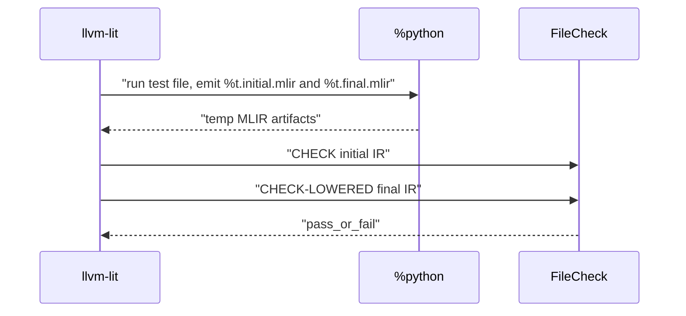

# Архитектура TT-Lang — Низкоуровневый дизайн: Тестирование

## 0. Метаданные

- **Статус**: Актуально (LLD).
- **Аудитория**: разработчики компилятора/переводчиков, maintainers тестовой инфраструктуры.
- **Фокус**: архитектура и назначение тестов (что доказываем), а не пошаговые команды (они в `test/TESTING.md`).
- **Связанные документы**:
  - `test/TESTING.md` (механика запуска)
  - `docs/01_Architecture/02_LLD_CompilerPipeline.md` (где ломается lowering/translate)
  - `docs/01_Architecture/04_LLD_Simulator.md` (симуляция)

## 1. Назначение

Этот документ описывает тестовую инфраструктуру tt‑lang как **архитектуру доказательств**: какие тестовые классы существуют, какие инварианты они должны проверять и куда добавлять новый тест.

Источник истины по тому, **как запускать тесты** (команды, targets, lit конфигурация): `test/TESTING.md`.

## 2. Основные категории тестов

### 2.1 MLIR lit tests (компиляторные)

Что доказывают (инварианты):

- **Корректность IR контрактов**: verifier'ы и канонические формы диалектов.
- **Корректность конверсий/легализации**: переходы TTL -> TTKernel -> EmitC (или другие).
- **Стабильность ключевых структур**: наличие/отсутствие ops/атрибутов, которые являются частью архитектурного контракта.

Где:

- `test/ttlang/` (Dialects / Conversion / Translate)

### 2.2 Python tests (DSL / runtime)

Эта группа обычно делится на две подгруппы с разной целью:

- **Python lit tests (IR-oriented)**: запускают Python DSL код и проверяют `%t.initial.mlir` и `%t.final.mlir` через FileCheck.
  - Что доказывают: что Python frontend и pipeline формируют ожидаемую структуру IR.
  - Почему важны: ловят регрессии "между Python и MLIR", не требуя железа.
- **Pytest tests (execution/runtime-oriented)**: проверяют поведение на устройстве (часто требуют `ttnn` + устройство).
  - Что доказывают: что артефакты реально выполняются и согласованы с runtime контрактом.

Где:

- `test/python/`

### 2.3 Simulator tests

Что доказывают (инварианты):

- корректность протоколов симулятора (CB reserve/push/pop, wait semantics, deadlock detection),
- отсутствие "тихих" обходов контрактов (ошибка должна быть диагностируема).

Где:

- `test/sim/`

### 2.4 ME2E (модельные E2E)

Что доказывают (инварианты):

- корректность сквозного сценария сборки program/kernels и выполнения на целевом окружении,
- устойчивость high-level API к реальным конфигурациям/оп-спекам.

Где:

- `test/me2e/`

## 3. Как выбрать место для нового теста (decision rules)

- Если меняется/добавляется pass или legality: добавлять MLIR lit в `test/ttlang/Conversion/` (и при необходимости negative test через diagnostics).
- Если меняется Python DSL валидация/ошибка/интерфейс: добавлять в `test/python/invalid/` (negative) или `test/python/` (positive), в зависимости от цели.
- Если меняется поведение симулятора (протокол/планирование): добавлять в `test/sim/`.
- Если изменения касаются runtime/ttnn интеграции или program descriptors: добавлять execution тест (pytest/ME2E), но стараться иметь параллельный "IR-oriented" тест, чтобы ловить регрессии раньше.

## 4. Типовые пайплайны тестов (архитектурно)

### 4.1 MLIR lit: `ttlang-opt` / `ttlang-translate` / FileCheck

Эта схема характерна для тестов, которые стартуют с MLIR и проверяют конверсии/переводчики.

```mermaid
sequenceDiagram
  participant Lit as llvm-lit
  participant Opt as ttlang-opt
  participant Tr as ttlang-translate
  participant FC as FileCheck

  Lit->>Opt: "run_pipeline(input.mlir)"
  Opt-->>Lit: "output_stage.mlir"
  Lit->>Tr: "translate(output_stage.mlir)"
  Tr-->>Lit: "output.cpp"
  Lit->>FC: "FileCheck(patterns, output.cpp)"
  FC-->>Lit: "pass_or_fail"
```

### 4.2 Python lit: `%python` -> `%t.initial.mlir`/`%t.final.mlir` -> FileCheck

Эта схема характерна для тестов, которые стартуют с Python DSL и проверяют IR на двух стадиях.

Подробности (RUN lines, best practices) - в `test/TESTING.md`.



## 5. Troubleshooting map (симптом -> где искать)

| Симптом | Наиболее вероятная причина | Где смотреть/фиксировать |
|---|---|---|
| `failed to legalize operation ...` | Ошибка конверсии/легализации, неполный pattern set | `lib/Dialect/TTL/Transforms/*`, LLD `02_LLD_CompilerPipeline.md`, тесты `test/ttlang/Conversion/` |
| `verification failed` / verifier diagnostic | Нарушен контракт диалекта или неверный тип/атрибут | соответствующий диалект/IR, lit тесты `test/ttlang/Dialects/` |
| `unsupported op ...` в переводчике | Переводчик не поддерживает новый op/атрибуты | `tools/ttlang-translate/*` + translate impls, `test/ttlang/Translate/` |
| Python invalid test неожиданно "проходит" | Валидация отсутствует или ошибка не выбрасывается | `python/ttl/ttl_api.py` (валидации), `python/ttl/diagnostics.py` |
| Симулятор deadlock/CBContractError | Нарушен протокол CB или планировщик/модель состояния | `python/sim/cbstate.py`, `python/sim/program.py`, `test/sim/` |
| `ttnn is not available` | Тест требует runtime, но окружение без ttnn | маркировать/перенести тест, или использовать simulator / IR-oriented тест |

## 6. Правила поддерживаемости (как делать тесты менее хрупкими)

- тесты должны проверять **инварианты**, а не случайный порядок,
- избегать слишком хрупких `CHECK-NEXT`, если вставки возможны по дизайну,
- добавлять отдельные маленькие регрессии под критические кейсы.
