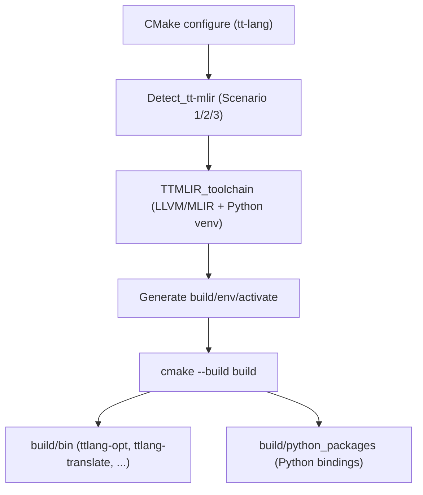

# Архитектура TT-Lang — Низкоуровневый дизайн: Система сборки

## 0. Метаданные

- **Статус**: Актуально (LLD).
- **Аудитория**: разработчики tt-lang/tt-mlir и интеграторы, которым нужно понять, почему сборка "завязана" на toolchain.
- **Источник истины по механике**: `docs/BUILD_SYSTEM.md` (команды и сценарии).
- **Цель этого файла**: объяснить архитектурные причины и границы ответственности сборки.

## 1. Назначение

Этот документ кратко фиксирует архитектуру сборки tt‑lang и привязки к tt‑mlir toolchain.

Источник истины по механике сборки: `docs/BUILD_SYSTEM.md`.
Здесь — LLD‑конспект с “крючками”, куда смотреть при проблемах.

## 2. Основная идея

tt‑lang использует CMake сборку, которая **переиспользует окружение и toolchain tt‑mlir** (LLVM/MLIR, Python venv, зависимости), чтобы:

- не дублировать сборку LLVM,
- гарантировать совместимость версий,
- стабилизировать поведение пайплайна.

### 2.1 Архитектурный контракт "один toolchain"

Сборка tt-lang считается корректной только если:

- C++ часть (MLIR/LLVM, диалекты, passes) и Python bindings используют **одни и те же** версии LLVM/MLIR,
- Python модуль `ttl` и связанные биндинги загружаются из того же окружения, с которым собраны нативные расширения,
- `ttlang-opt`/`ttlang-translate` видят те же зарегистрированные диалекты/пасс-фабрики, что и Python слой.

Практический смысл: большинство "странных" ошибок (линковка, missing symbols, падения при импорте) являются не ошибками логики, а нарушением этого контракта.

### 2.2 Высокоуровневая схема сборки

## 3. Сценарии интеграции с tt‑mlir (L1)

См. `docs/BUILD_SYSTEM.md`:

- **Scenario 1: Pre-built tt-mlir (Dev Mode)**
  - указать `TTMLIR_BUILD_DIR`
- **Scenario 2: Pre-installed tt-mlir (Recommended)**
  - использовать `TTMLIR_TOOLCHAIN_DIR` (по умолчанию `/opt/ttmlir-toolchain`)
- **Scenario 3: Automatic build**
  - взять commit из `third-party/tt-mlir.commit`, собрать локально в build

### 3.1 Как выбрать сценарий (decision rules)

- Выбор **Scenario 1** оправдан, если одновременно ведется разработка tt-mlir и нужен быстрый итерационный цикл без install step.
- Выбор **Scenario 2** является базовым (рекомендуемым), если доступен корректно установленный toolchain: это дает наиболее воспроизводимую сборку.
- Выбор **Scenario 3** подходит для bootstrap/CI окружений, где нет установленного toolchain, но допустимо автоматически собрать pinned tt-mlir.

## 4. Что является "артефактами" сборки (архитектурно)

Типично интересны три класса артефактов:

- **CLI инструменты**: `build/bin/ttlang-opt`, `build/bin/ttlang-translate` (драйверы для passes/translations).
- **Python пакеты/биндинги**: создаются в `build/python_packages/*` и/или подключаются через `build/env/activate`.
- **Локальная установка tt-mlir** (только Scenario 3): `build/tt-mlir-install/`.

## 4. Ключевые директории build артефактов

Типично:

- `build/bin/` — `ttlang-opt`, `ttlang-translate`
- `build/tt-mlir-install/` — локальная установка tt‑mlir (для scenario 3)
- `build/_deps/tt-mlir-src/` — исходники tt‑mlir (FetchContent)

## 5. Типовые проблемы

- “не найден toolchain” → проверить `TTMLIR_TOOLCHAIN_DIR` / `TTMLIR_BUILD_DIR`.
- “несовместимые символы/линковка” → проверить, что toolchain и tt‑mlir совпадают по версии и собраны с нужными биндингами.
- “python/venv mismatch” → убедиться, что активирован правильный env из toolchain.

### 5.1 Где искать источник истины

- Полная механика (приоритеты обнаружения tt-mlir, генерация `build/env/activate`, переменные): `docs/BUILD_SYSTEM.md`.
- Архитектурная мотивация (почему это важно): этот документ + HLD `docs/01_Architecture/01_HighLevelDesign.md`.
