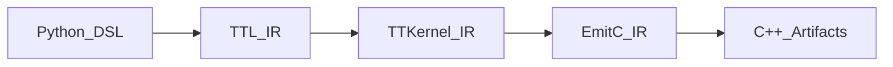
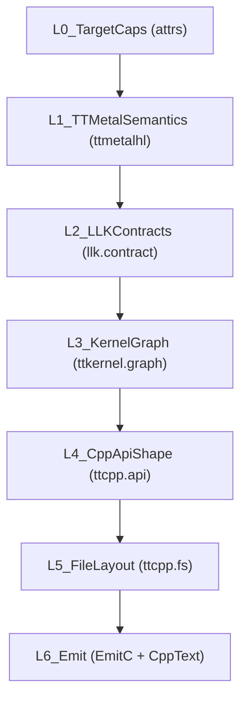
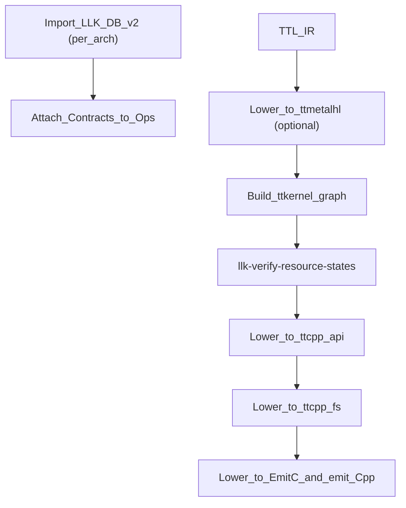
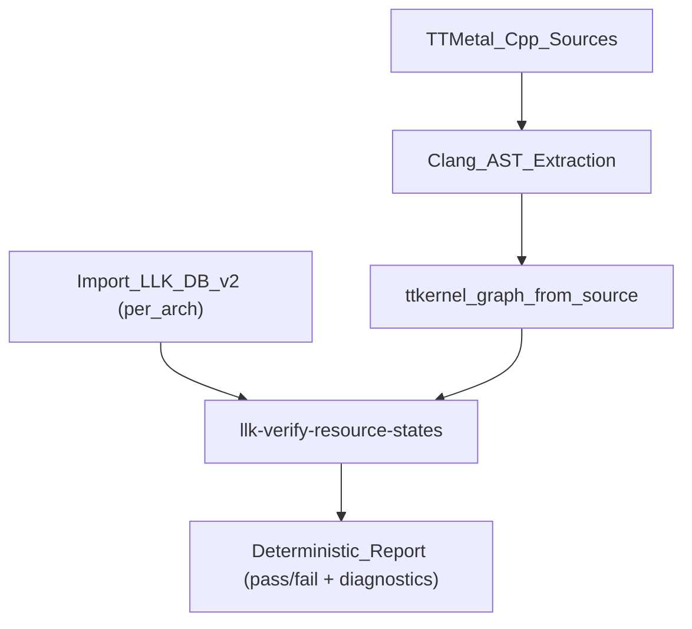
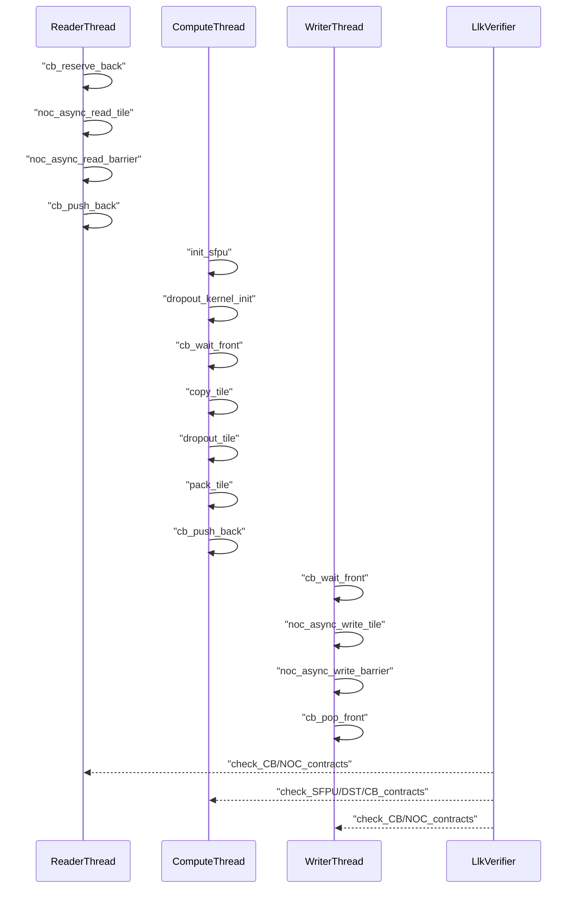

# Архитектура TT-Lang — Низкоуровневый дизайн: Layered IR для валидации TT-metal/LLK (LLK DB v2) и поздней эмиссии кода

## 0. Метаданные

- **Статус**: Предложение (дизайн-документ; не отражает текущую реализацию 1:1).
- **Аудитория**: разработчики диалектов/пасс-пайплайнов, а также инженеры, которые хотят строгую семантическую валидацию LLK протоколов.
- **Зачем**: отделить "семантику и контракты" от "формы C++/файлов", чтобы получить системную (CFG-aware) валидацию и позднюю эмиссию.
- **Связанные документы**:
  - `docs/01_Architecture/01_HighLevelDesign.md`
  - `docs/01_Architecture/02_LLD_CompilerPipeline.md`
  - `docs/ideas/10_layered_ir_validation.md` (локальный SDLC-трекинг инициативы)

## 1. Назначение

Этот документ предлагает layered-структуру MLIR представлений и pass'ов, которая позволяет:

- максимально долго оставаться в MLIR (до стадии, когда смысл и протоколы уже проверены),
- валидировать корректность использования LLK примитивов, включая hardware-ветвления (например `blackhole` vs `wormhole_b0`),
- отделить "семантику и контракты" от "API shape/раскладки по файлам/стиля",
- поздно эмитить C++/файловое дерево так, чтобы выход можно было проверять `clang-format/clang-tidy` и сравнивать 1-в-1.

Документ является дизайном: он описывает слои и интерфейсы так, как будто это будущая реализация в tt-lang/ttmlir.

## 2. Контекст: что уже существует и почему это важно

### 2.1 Текущий компиляционный путь tt-lang

Текущий пайплайн в tt-lang фиксируется в:

- `docs/01_Architecture/01_HighLevelDesign.md`
- `docs/01_Architecture/02_LLD_CompilerPipeline.md`

Логическая цепочка:



### 2.2 Как это соотносится с tt-lang сегодня (fit today)

Что уже есть (как "опорные факты" текущей реализации):

- TTL pipeline и порядок ключевых passes, включая DST assignment/sync, lowering к loops, и lowering к TTKernel (`lib/Dialect/TTL/Pipelines/TTLPipelines.cpp`).
- Python frontend, который строит MLIR module из thread-функций и запускает pass pipeline через `PassManager` (`python/ttl/ttl_api.py`).
- Инструменты `ttlang-opt` и `ttlang-translate` как драйверы passes и translations (`tools/ttlang-opt/*`, `tools/ttlang-translate/*`).

Чего в текущей архитектуре нет (и что предлагает этот proposal):

- Явного слоя/диалекта, который кодирует **контракты LLK ресурсов** как часть IR и позволяет делать CFG-aware валидацию протоколов.
- Разделения "семантика" vs "форма C++/файловое дерево" на отдельные валидируемые слои (L4/L5 в терминах этого документа).
- Стандартизированного "source-audit" пути, который извлекает семантический call graph из существующего C++ (Clang AST) и валидирует его тем же verifier'ом.

### 2.3 LLK DB v2 как источник истины для контрактов

В tt-metal уже есть канонический экспорт LLK DB v2:

- `tt-metal: docs/llk_db_v2/build/llk_db_v2.json`

В `prompts-search` есть vendored LLK DB v2 (Nickel + YAML exports + примеры/recipe):

- `prompts-search: docs/ttmetal/llk_db_v2/README.md`
- `prompts-search: docs/ttmetal/llk_db_v2/build/llk_db_v2.json`
- `prompts-search: docs/ttmetal/llk_db_v2/nickel/`
- `prompts-search: docs/ttmetal/llk_db_v2/generated/`

Примечание: ссылки `tt-metal:` и `prompts-search:` указывают на **другие репозитории** и даны как ориентир для инженера (они не являются путями внутри дерева tt-lang).

Важно: LLK DB v2 описывает ресурсы/состояния/инварианты типизированно и может служить
единым "словарем" требований/эффектов:

- ресурсы: `CB`, `DST`, `SFPU`, `NOC`, `CFG`, ...
- контракты: `pre/effects/post`
- глобальные инварианты (например, “dropout требует seeded PRNG”)

### 2.4 Dropout как эталонный тест-кейс семантической валидации

В `prompts-search` есть "сквозной" dropout trace с привязкой к LLK DB:

- `prompts-search: docs/ttmetal_dropout_llk_trace.md`

Этот документ полезен как инженерный "oracle": он показывает реальный порядок вызовов и
согласованность requires/produces для CB/DST/NOC/SFPU.

## 3. Проблема: почему текущие уровни IR недостаточны для строгой валидации и поздней эмиссии

Если сразу опускаться к TTKernel/EmitC и далее к тексту C++, то:

- контракты LLK остаются "в голове" или в разрозненных проверках,
- корректность протоколов (CB reserve/push/pop, DST acquire/commit/wait/release, NOC barriers, SFPU init) трудно проверять системно,
- "семантика" смешивается с "формой" (классы/файлы/стиль), и диагностика становится менее точной,
- аппаратные ветвления (`blackhole` vs `wormhole_b0`) реализуются как условные ветки/ifdef без единого места проверки.

Нужен слой, где:

- смысл ops выражен явно,
- требования/эффекты проверяются как dataflow по CFG,
- а "раскладка по файлам" появляется позже и проверяется отдельно.

## 4. Предлагаемая layered-структура IR (L0..L6)

Ниже приведены слои и их обязанности. Названия диалектов условные.



### 4.1 L0: Target+Capabilities (module attrs)

Назначение: зафиксировать "платформу" как часть IR, чтобы:

- выбрать допустимые примитивы/варианты,
- валидировать ограничения (число CB/DST, наличие SFPU, особенности arch),
- обеспечить детерминированную диспетчеризацию по arch.

Пример (псевдо-MLIR):

```mlir
module attributes {
  tt.target = #tt.target<arch="blackhole", num_cb=32, num_dst=8, has_sfpu=true>
} {
  // ...
}
```

### 4.2 L1: TT-metal Op Semantics Dialect (`ttmetalhl`)

Назначение: выражать "смысл" TT-metal high-level op независимо от файлов/классов:

- входы/выходы, layout/memory constraints,
- требуемые LLK high-level ops (например `dropout_kernel_init`, `dropout_tile`),
- hardware-ветвления как часть IR (а не условные ветки в текстовом коде).

Пример (псевдо-IR):

```text
ttmetalhl.dropout {
  requires_llk = ["*.high_level.dropout_kernel_init", "*.high_level.dropout_tile"]
  variants = [
    { arch="blackhole", impl_id="blackhole.dropout" },
    { arch="wormhole_b0", impl_id="wormhole.dropout" }
  ]
}
```

### 4.3 L2: Контракты LLK (`llk.contract`) + OpInterface

Назначение: сделать LLK DB v2 источником истины для требований/эффектов примитивов и
разрешить валидацию на IR уровне.

Механизм:

- Import LLK DB v2 (JSON/Nickel) в "таблицу" доступных примитивов для заданного `arch`.
- Каждый relevant op в downstream IR реализует интерфейс:

```cpp
class ResourceContractInterface {
public:
  void getRequirements(SmallVectorImpl<Requirement> &out) const;
  void getEffects(SmallVectorImpl<Effect> &out) const;
  void getPostconditions(SmallVectorImpl<Postcondition> &out) const;
};
```

Pass `llk-verify-resource-states`:

- строит CFG и выполняет dataflow-анализ ресурсных состояний,
- проверяет совместимость операций по протоколам CB/DST/NOC/SFPU,
- выдаёт детерминированные diagnostics (точка, ресурс, ожидаемое/фактическое).

Источник терминологии/идеи интерфейса и CFG-aware проверки:

- `prompts-search: docs/ttmetal/llk_db_v2/TTLang_resource_states.md`

### 4.4 L3: Kernel Graph Dialect (`ttkernel.graph`)

Назначение: иметь MLIR слой, где reader/compute/writer выражены как:

- отдельные threads/regions,
- последовательности LLK примитивов и синхронизации,
- явные точки обмена через CB/NOC.

Этот слой удобен для:

- проверки, что high-level TT-metal op действительно разложился в набор LLK high-level ops,
- проверки, что LLK high-level ops разложились в допустимые low-level примитивы (SFPU micro-ops),
- фиксации arch-specific ветвлений (вариантов) как данных.

Dropout (упрощенно) как "thread-level композиция":

```text
ReaderThread:
  cb_reserve_back -> get_write_ptr -> noc_async_read_tile -> noc_async_read_barrier -> cb_push_back

ComputeThread:
  init_sfpu -> dropout_kernel_init -> cb_wait_front -> copy_tile -> dropout_tile -> pack_tile -> cb_push_back

WriterThread:
  cb_wait_front -> get_read_ptr -> noc_async_write_tile -> noc_async_write_barrier -> cb_pop_front
```

Эта структура верифицируется контракторами L2 и хорошо совпадает с "oracle trace" dropout:

- `prompts-search: docs/ttmetal_dropout_llk_trace.md`

### 4.5 L4: C++ API Shape Dialect (`ttcpp.api`)

Назначение: выразить "контракты публичных интерфейсов" в терминах сущностей, но не файлов:

- `DeviceOperation` shape (обязательные методы),
- `ProgramFactory` shape,
- binding entrypoints (pybind signatures),
- стабильные сигнатуры и типы.

Это делает возможной проверку "API формы" до того, как появится текст C++.

Pass `ttcpp-verify-api-shape`:

- проверяет, что обязательные сущности присутствуют,
- проверяет сигнатуры/квалификаторы/порядок аргументов,
- генерирует строгие диагностики "что отсутствует/не совпало".

### 4.6 L5: File/Layout Dialect (`ttcpp.fs`)

Назначение: отделить решение "что за сущности должны быть" от "куда они ложатся":

- файловое дерево (paths),
- mapping сущностей в файлы,
- include-граф и инварианты репозитория,
- anchors/required-lines, когда требуется byte-стабильность.

Pass `ttcpp-verify-layout`:

- проверяет, что структура файлов соответствует ожидаемому шаблону,
- проверяет include порядок/правила проекта,
- проверяет, что anchors применены строго.

### 4.7 L6: Emit layer (EmitC + текст)

Назначение: поздно превратить `ttcpp.*` в итоговый текст/файлы.

Практичный вариант:

- lowering `ttcpp.api`/`ttcpp.fs` -> `emitc.*` (или другой печатаемый MLIR слой),
- затем использовать существующий `ttlang-translate` (TTKernel/EmitC -> C++).

Вариант "future work" для максимально стабильной печати:

- промежуточный Lex/Token IR слой перед текстом,
- возможность генерировать 1-в-1 код с контролируемым форматированием,
- последующий запуск `clang-tidy`/`clang-format` как отдельная стадия валидации.

## 5. Layered pass pipeline (предложение)

### 5.1 Generation-first (tt-lang)

Цель: источник истины является MLIR, а LLK DB v2 используется для валидации.



Ключ: `llk-verify-resource-states` должен происходить до стадий, где уже появляется файловая раскладка.

### 5.2 Source-audit (tt-metal)

Цель: валидировать существующий C++/TT-metal код на предмет корректного использования LLK и
соответствия контрактам LLK DB v2.

Идея: использовать Clang AST как "extractor", чтобы получить компактный IR фактологии:

- какие LLK high-level ops вызываются (`dropout_kernel_init`, `dropout_tile`),
- какие low-level примитивы используются (CB/DST/NOC/SFPU),
- в каком порядке и в каких thread-контекстах.

Затем повторно применить те же контракты и тот же CFG-aware verifier.



Примечание: на этом этапе не требуется генерировать C++; требуется только извлечь структуру вызовов
и сопоставить с контрактами.

## 6. Пример: dropout как тест-кейс (blackhole/wormhole)

### 6.1 Что именно хочется валидировать

- High-level TT-metal dropout использует LLK high-level ops: `dropout_kernel_init`, `dropout_tile`.
- Эти high-level ops требуют корректного состояния SFPU (например PRNG seeded) и корректных протоколов DST/CB.
- Dataflow читает/пишет через NOC и использует соответствующие barriers.
- Архитектурные ветвления выбираются детерминированно по `tt.target.arch`.

### 6.2 Пример последовательности (на уровне потоков)



## 7. Что является "границами ответственности" между слоями

Ключевое правило: каждый слой должен быть валидируем отдельно, а переход между слоями должен быть
детерминированным и наблюдаемым.

- L1/L2/L3: смысл и ресурсы, контракты, корректность протоколов.
- L4: форма публичных интерфейсов (классы/методы/сигнатуры).
- L5: раскладка по файлам, include-граф, anchors/required-lines.
- L6: печать текста и финальные проверки форматирования/статического анализа.

## 8. Стратегия тестирования (на уровне инфраструктуры)

Минимальный набор тестов, который дает быстрый feedback:

- MLIR lit tests для verifier'а контрактов (negative и positive):
  - verify-diagnostics для негативных кейсов (ошибка протокола CB/DST/NOC).
- MLIR tests на соответствие dropout композиции (на уровне `ttkernel.graph`).
- Source-audit tests для извлечения из C++ (минимальные фикстуры + golden "call graph").

Для "oracle" сверки полезно использовать существующую dropout трассу:

- `prompts-search: docs/ttmetal_dropout_llk_trace.md`

## 9. Открытые вопросы и non-goals

### 9.1 Non-goals (на текущем этапе)

- Полная реализация графовой БД/хранилища семантики (это возможно позже).
- Гарантия byte-идентичности C++ без anchors/required-lines (это требует Lex/Token IR или строгого печатающего слоя).

### 9.2 Открытые вопросы

- Какой набор ресурсов/полей LLK DB v2 является минимально достаточным для полезной валидации в tt-lang (CB/DST/SFPU/NOC как старт).
- Как формализовать связь "адрес L1" <-> "CB id" для NOC примитивов в IR без потери точности.
- Где лучше хранить arch-specific "варианты" (в L1 как variants, или в L3 как отдельные thread-реализации).

## 10. Короткий вывод

Layered IR подход позволяет отделить "семантику и контракты" от "формы C++/файлов", сделать
валидацию LLK протоколов системной (CFG-aware) и поддержать arch-ветвления как данные.
Dropout является удобным эталоном, потому что уже есть формальная LLK DB v2 и сквозной trace,
который можно использовать как oracle для проверки корректности.
