# 01: Сократить копипаст в Passes.cpp с помощью небольших helper-функций для биндингов (upstream tt-mlir)

## Сводка

`python/Passes.cpp` в upstream `tt-mlir` содержит повторяющиеся, почти одинаковые тела биндингов для:

- запуска именованного pass pipeline с опциями (создание `PassManager`, lookup pipeline, add, run, throw);
- подготовки registry трансляций в LLVM IR и file I/O для переводчиков (registry, append, open file, call translator, throw);
- чтения типизированного атрибута из `func.func` по имени (сейчас делается через полный `walk`).

Этот документ предлагает небольшой, явный набор helper-функций, чтобы централизовать boilerplate, сохранив читаемость каждого `m.def(...)` и локальную понятность.

## Цели

- Снизить копипаст и дрейф сообщений об ошибках, не меняя Python API.
- Сделать типовые ошибки единообразными (pipeline not found, pipeline add failure, PM run failure, file open failure).
- Предпочитать \(O(1)\) lookup по символу для запросов `func.func` по имени.

## Не-цели

- Не менять Python API (имена функций, аргументы, типы возвращаемых значений).
- Не вводить большой “framework” для биндингов; избегать heavy macro дизайнов.
- Не менять поведение pipeline/translator; только рефакторинг glue.

## Где это должно быть реализовано

Файл, который открыт в редакторе, является build/install артефактом. Upstream исходники, которые нужно рефакторить, локально представлены как:

- `tt-lang/build/_deps/tt-mlir-src/python/Passes.cpp`

Примеры кода ниже используют этот файл как контекст “до”.

## Примеры проблемы (до)

### A. Boilerplate запуска именованного pipeline

Одинаковая последовательность повторяется для нескольких pipeline, меняются только строка lookup и конструктор `PassManager`.

```cpp
// BEFORE (excerpt; see Passes.cpp for full binding)
m.def(
    "stablehlo_pipeline",
    [](MlirModule module, std::string options = "") {
      mlir::Operation *moduleOp = unwrap(mlirModuleGetOperation(module));
      mlir::PassManager pm(moduleOp->getContext());

      const auto *pipeline = mlir::PassPipelineInfo::lookup("stablehlo-pipeline");
      std::function<mlir::LogicalResult(const llvm::Twine &)> err_handler =
          [](const llvm::Twine &) { return mlir::failure(); };

      if (mlir::failed(pipeline->addToPipeline(pm, options, err_handler))) {
        throw std::runtime_error("Failed to add pipeline to pass manager");
      }

      if (mlir::failed(pm.run(moduleOp))) {
        throw std::runtime_error("Failed to run pass manager");
      }
    },
    nb::arg("module"), nb::arg("options") = "");
```

### B. Boilerplate registry трансляций в LLVM + file I/O

Повторяется для file-based translators и для in-memory translation.

```cpp
// BEFORE (excerpt)
m.def("ttnn_to_flatbuffer_file",
      [](MlirModule module, std::string &filepath, /* ... */) {
        mlir::Operation *moduleOp = unwrap(mlirModuleGetOperation(module));

        mlir::DialectRegistry registry;
        registerAllToLLVMIRTranslations(registry);
        moduleOp->getContext()->appendDialectRegistry(registry);

        std::error_code fileError;
        llvm::raw_fd_ostream file(filepath, fileError);
        if (fileError) {
          throw std::runtime_error("Failed to open file: " + filepath +
                                   ". Error: " + fileError.message());
        }

        if (mlir::failed(mlir::tt::ttnn::translateTTNNToFlatbuffer(
                moduleOp, file, goldenMap, moduleCache))) {
          throw std::runtime_error("Failed to write flatbuffer to file: " +
                                   filepath);
        }
      });
```

### C. `func.func` lookup по имени через `walk`

Это шумно и имеет сложность \(O(N)\) по числу функций.

```cpp
// BEFORE (excerpt)
m.def(
    "get_ttkernel_arg_spec",
    [](MlirModule module, std::string kernelName) -> std::optional<MlirAttribute> {
      mlir::Operation *moduleOp = unwrap(mlirModuleGetOperation(module));
      auto mod = mlir::cast<ModuleOp>(moduleOp);

      std::optional<MlirAttribute> result;
      mod.walk([&](func::FuncOp funcOp) {
        if (funcOp.getName() == kernelName) {
          if (auto argSpecAttr =
                  funcOp->getAttrOfType<mlir::tt::ttkernel::ArgSpecAttr>(
                      mlir::tt::ttkernel::ArgSpecAttr::name)) {
            result = wrap(argSpecAttr);
          }
        }
      });
      return result;
    },
    nb::arg("module"), nb::arg("kernel_name"));
```

## Предлагаемый подход (после)

Добавить несколько небольших helper-функций, варианты:

- **Вариант 1 (локально)**: anonymous namespace вверху `python/Passes.cpp`.
- **Вариант 2 (общий)**: небольшой header/source в upstream `tt-mlir` для binding utilities (предпочтительно, если `python/*.cpp` файлов несколько).

### Эскизы helper-функций

```cpp
namespace {

mlir::Operation *unwrapModuleOp(MlirModule module) {
  return unwrap(mlirModuleGetOperation(module));
}

mlir::ModuleOp unwrapModule(MlirModule module) {
  return mlir::cast<mlir::ModuleOp>(unwrapModuleOp(module));
}

enum class PassManagerKind { UseContext, UseName, UseNameImplicitNesting };

mlir::PassManager createPassManager(mlir::Operation *moduleOp, PassManagerKind kind) {
  switch (kind) {
  case PassManagerKind::UseContext:
    return mlir::PassManager(moduleOp->getContext());
  case PassManagerKind::UseName:
    return mlir::PassManager(moduleOp->getName());
  case PassManagerKind::UseNameImplicitNesting:
    return mlir::PassManager(moduleOp->getName(), mlir::PassManager::Nesting::Implicit);
  }
  llvm_unreachable("Unhandled PassManagerKind");
}

void runNamedPipelineOrThrow(mlir::Operation *moduleOp,
                             llvm::StringRef pipelineName,
                             llvm::StringRef options,
                             PassManagerKind pmKind) {
  mlir::PassManager pm = createPassManager(moduleOp, pmKind);

  const auto *pipeline = mlir::PassPipelineInfo::lookup(pipelineName);
  if (pipeline == nullptr) {
    throw std::runtime_error(("Unknown pipeline: " + pipelineName).str());
  }

  auto errHandler = [](const llvm::Twine &) { return mlir::failure(); };
  if (mlir::failed(pipeline->addToPipeline(pm, options, errHandler))) {
    throw std::runtime_error(("Failed to add pipeline: " + pipelineName).str());
  }

  if (mlir::failed(pm.run(moduleOp))) {
    throw std::runtime_error(("Failed to run pipeline: " + pipelineName).str());
  }
}

void ensureLLVMIRTranslationsRegistered(mlir::Operation *moduleOp) {
  mlir::DialectRegistry registry;
  registerAllToLLVMIRTranslations(registry);
  moduleOp->getContext()->appendDialectRegistry(registry);
}

llvm::raw_fd_ostream openFileOrThrow(const std::string &filepath) {
  std::error_code ec;
  llvm::raw_fd_ostream file(filepath, ec);
  if (ec) {
    throw std::runtime_error("Failed to open file: " + filepath + ". Error: " + ec.message());
  }
  return file;
}

// Prefer lookupSymbol instead of walk for name lookups.
mlir::func::FuncOp lookupFuncOrNull(mlir::ModuleOp mod, llvm::StringRef name) {
  return mod.lookupSymbol<mlir::func::FuncOp>(name);
}

template <typename AttrT>
std::optional<MlirAttribute> getFuncAttrOptional(mlir::ModuleOp mod,
                                                 llvm::StringRef funcName,
                                                 llvm::StringRef attrName) {
  if (auto f = lookupFuncOrNull(mod, funcName)) {
    if (auto attr = f->getAttrOfType<AttrT>(attrName)) {
      return wrap(attr);
    }
  }
  return std::nullopt;
}

} // namespace
```

### Обновленные биндинги на основе helper-функций (после)

#### A. Пример pipeline

```cpp
// AFTER
m.def(
    "stablehlo_pipeline",
    [](MlirModule module, std::string options = "") {
      runNamedPipelineOrThrow(
          unwrapModuleOp(module), /*pipelineName=*/"stablehlo-pipeline",
          /*options=*/options, /*pmKind=*/PassManagerKind::UseContext);
    },
    nb::arg("module"), nb::arg("options") = "");
```

#### B. Пример file translator

```cpp
// AFTER
m.def("ttnn_to_flatbuffer_file",
      [](MlirModule module, std::string &filepath, /* ... */) {
        mlir::Operation *moduleOp = unwrapModuleOp(module);
        ensureLLVMIRTranslationsRegistered(moduleOp);

        auto file = openFileOrThrow(filepath);
        if (mlir::failed(mlir::tt::ttnn::translateTTNNToFlatbuffer(
                moduleOp, file, goldenMap, moduleCache))) {
          throw std::runtime_error("Failed to write flatbuffer to file: " + filepath);
        }
      });
```

#### C. `get_ttkernel_arg_spec` через symbol lookup

```cpp
// AFTER
m.def(
    "get_ttkernel_arg_spec",
    [](MlirModule module, std::string kernelName) -> std::optional<MlirAttribute> {
      return getFuncAttrOptional<mlir::tt::ttkernel::ArgSpecAttr>(
          unwrapModule(module), /*funcName=*/kernelName,
          /*attrName=*/mlir::tt::ttkernel::ArgSpecAttr::name);
    },
    nb::arg("module"), nb::arg("kernel_name"));
```

## Mermaid: поток вызовов до/после

### Pipeline binding

```mermaid
flowchart TD
  subgraph before [До]
    b0[PythonBindingLambda] --> b1[unwrap MlirModule]
    b1 --> b2[create PassManager]
    b2 --> b3[PassPipelineInfo.lookup]
    b3 --> b4[pipeline.addToPipeline]
    b4 --> b5[pm.run]
    b5 --> b6[throw on failure]
  end

  subgraph after [После]
    a0[PythonBindingLambda] --> a1[runNamedPipelineOrThrow]
    a1 --> a2[unwrap+create PM]
    a2 --> a3[lookup+add+run]
    a3 --> a4[uniform errors]
  end
```



### Attr getter binding


## Компромиссы

- **Плюсы**: сильное сокращение LOC, меньше возможностей для несогласованной обработки ошибок, более читаемые lambdas, более стабильная производительность (lookupSymbol вместо walk).
- **Минусы**: появляется слой helper-функций; его нужно держать минимальным, чтобы не превратить в мини‑framework.

## Рекомендуемые шаги миграции

1. Добавить helpers локально в `python/Passes.cpp` (anonymous namespace) и отрефакторить 2-3 биндинга (один pipeline, один translator, один attr getter).
2. Если helpers полезны и в других binding файлах (`python/Util.cpp` и т.п.), вынести их в общий upstream header/source.
3. Переводить остальные биндинги на новый стиль по мере касания связанного кода.

## Явное ограничение области

- **Upstream изменения (tt-mlir)**: рефакторинг `python/Passes.cpp` (и опционально добавление небольшого shared helper header/source).
- **Стабильная поверхность**: имена Python функций, аргументы и типы возвращаемых значений остаются без изменений.
