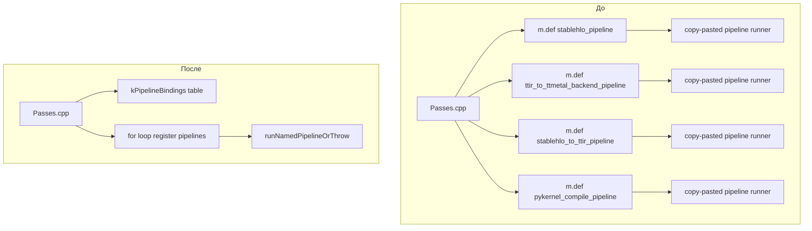

# 02: Сократить копипаст в Passes.cpp через табличную регистрацию биндингов (upstream tt-mlir)

## Сводка

Этот документ делает шаг дальше, чем “helper-функции”, и предлагает сделать значительную часть `python/Passes.cpp` декларативной:

- определить таблицы спецификаций биндингов (pipelines, translators, attr getters);
- регистрировать их простыми циклами поверх общих helper-функций.

По сравнению с идеей 01, это дает большее сокращение LOC и сильнее фиксирует “single source of truth” для binding surface, но делает чтение файла сверху вниз чуть менее прямолинейным.

## Цели

- Сохранить стабильность Python API при минимизации boilerplate.
- Упростить добавление нового pipeline binding или translator: достаточно добавить одну строку в таблицу.
- Сохранить единообразную и информативную обработку ошибок.

## Не-цели

- Не использовать auto-generation из TableGen, YAML или Python stubs.
- Не использовать макросы, скрывающие control flow; предпочтение данным и простым циклам.

## Где это должно быть реализовано

Как и в идее 01, “реальный” объект рефакторинга находится в upstream `tt-mlir`. Локально текущий snapshot представлен файлом:

- `tt-lang/build/_deps/tt-mlir-src/python/Passes.cpp`

## Формулировка проблемы (до)

Текущий файл регистрирует много `m.def(...)`, где меняются только несколько полей:

- `pyName` (имя Python функции);
- `pipelineName` (строка для `PassPipelineInfo::lookup`);
- “форма” pass manager (`PassManager(context)` vs `PassManager(name)` vs implicit nesting).

Пример (из `Passes.cpp`):

```cpp
// BEFORE (excerpt)
m.def(
    "ttir_to_ttmetal_backend_pipeline",
    [](MlirModule module, std::string options = "") {
      mlir::Operation *moduleOp = unwrap(mlirModuleGetOperation(module));
      mlir::PassManager pm(moduleOp->getName());

      const auto *pipeline = mlir::PassPipelineInfo::lookup("ttir-to-ttmetal-pipeline");
      std::function<mlir::LogicalResult(const llvm::Twine &)> err_handler =
          [](const llvm::Twine &) { return mlir::failure(); };
      if (mlir::failed(pipeline->addToPipeline(pm, options, err_handler))) {
        throw std::runtime_error("Failed to add pipeline to pass manager");
      }
      if (mlir::failed(pm.run(moduleOp))) {
        throw std::runtime_error("Failed to run pass manager");
      }
    },
    nb::arg("module"), nb::arg("options") = "");
```

## Предлагаемый подход (после)

### Шаг 1: сохранить небольшой helper-слой из идеи 01

Используются те же helpers, например `runNamedPipelineOrThrow(...)` и `PassManagerKind` (см. идею 01). Отличие в том, что не пишутся почти одинаковые лямбды для каждого биндинга.

### Шаг 2: определить спецификации биндингов

#### A. Pipelines

```cpp
enum class PassManagerKind { UseContext, UseName, UseNameImplicitNesting };

struct PipelineBindingSpec {
  const char *pyName;
  const char *pipelineName;
  PassManagerKind pmKind;
};

static constexpr PipelineBindingSpec kPipelineBindings[] = {
    {"stablehlo_pipeline", "stablehlo-pipeline", PassManagerKind::UseContext},
    {"ttir_to_ttnn_backend_pipeline", "ttir-to-ttnn-backend-pipeline", PassManagerKind::UseName},
    {"ttir_to_ttmetal_backend_pipeline", "ttir-to-ttmetal-pipeline", PassManagerKind::UseName},
    {"stablehlo_to_ttir_pipeline", "stablehlo-to-ttir-pipeline", PassManagerKind::UseNameImplicitNesting},
    {"ttir_to_emitpy_pipeline", "ttir-to-emitpy-pipeline", PassManagerKind::UseContext},
    {"pykernel_compile_pipeline", "pykernel-compile-pipeline", PassManagerKind::UseName},
    // ... keep adding rows ...
};
```

#### B. Translators (file/bin)

Для translators есть дополнительная вариативность (file vs capsule, какой translator вызывается, нужно ли регистрировать LLVM IR translations).

```cpp
enum class TranslationMode { File, Capsule };

struct TranslatorBindingSpec {
  const char *pyName;
  TranslationMode mode;
  bool needsLLVMIRTranslations;
};

// Note: actual translator invocation still needs per-binding code (function pointer / lambda),
// but the common prelude is table-driven.
```

На практике подход работает лучше, если translator bindings также используют helpers:

- `ensureLLVMIRTranslationsRegistered(moduleOp)`
- `openFileOrThrow(filepath)`

Тогда в per-binding lambda остается только вызов конкретного translator.

#### C. Attr getters

```cpp
struct FuncAttrGetterSpec {
  const char *pyName;
  const char *attrName;
};

static constexpr FuncAttrGetterSpec kTTKernelAttrGetters[] = {
    {"get_ttkernel_arg_spec", mlir::tt::ttkernel::ArgSpecAttr::name},
    // future: {"get_ttkernel_something", SomeAttr::name},
};
```

### Шаг 3: зарегистрировать таблицы

#### A. Цикл регистрации pipelines

```cpp
for (const auto &spec : kPipelineBindings) {
  m.def(
      spec.pyName,
      [spec](MlirModule module, std::string options = "") {
        runNamedPipelineOrThrow(
            unwrapModuleOp(module), spec.pipelineName, options, spec.pmKind);
      },
      nb::arg("module"), nb::arg("options") = "");
}
```

#### B. Цикл attr getter (пример для TTKernel attrs)

Этот блок можно специализировать по типу атрибута (или по группе диалектов), потому что типизированный класс атрибута отличается.

```cpp
m.def(
    "get_ttkernel_arg_spec",
    [](MlirModule module, std::string kernelName) -> std::optional<MlirAttribute> {
      return getFuncAttrOptional<mlir::tt::ttkernel::ArgSpecAttr>(
          unwrapModule(module), kernelName, mlir::tt::ttkernel::ArgSpecAttr::name);
    },
    nb::arg("module"), nb::arg("kernel_name"));
```

Если getters одного и того же `AttrT` несколько, то вариант будет таким:

```cpp
for (const auto &spec : kTTKernelAttrGetters) {
  m.def(
      spec.pyName,
      [spec](MlirModule module, std::string kernelName) -> std::optional<MlirAttribute> {
        return getFuncAttrOptional<mlir::tt::ttkernel::ArgSpecAttr>(
            unwrapModule(module), kernelName, spec.attrName);
      },
      nb::arg("module"), nb::arg("kernel_name"));
}
```

## Mermaid: организация до/после



## Компромиссы

- **Плюсы**:
  - заметное сокращение boilerplate для семейства “pipeline runner”;
  - четкий, проверяемый список поддерживаемых pipeline биндингов;
  - единообразные имена и default аргументы.
- **Минусы**:
  - чуть сложнее “поставить брейкпоинт в конкретную лямбду”, так как она генерируется циклом;
  - требуется дисциплина, чтобы держать таблицы компактными и логично группировать (pipelines vs translators vs misc).

## Рекомендуемые шаги миграции

1. Сначала ввести helper-слой (идея 01) и использовать его для 2-3 биндингов.
2. Перевести на табличную регистрацию только pipeline bindings (минимальный риск и максимальная унификация).
3. Рассмотреть табличное групповое описание для других семейств, если они разрастаются (например, много attr getters одного `AttrT`).

## Явное ограничение области

- **Upstream изменения (tt-mlir)**: рефакторинг `python/Passes.cpp` (и опционально добавление небольшого shared helper header/source).
- **Стабильная поверхность**: имена Python функций, аргументы и типы возвращаемых значений остаются без изменений.
