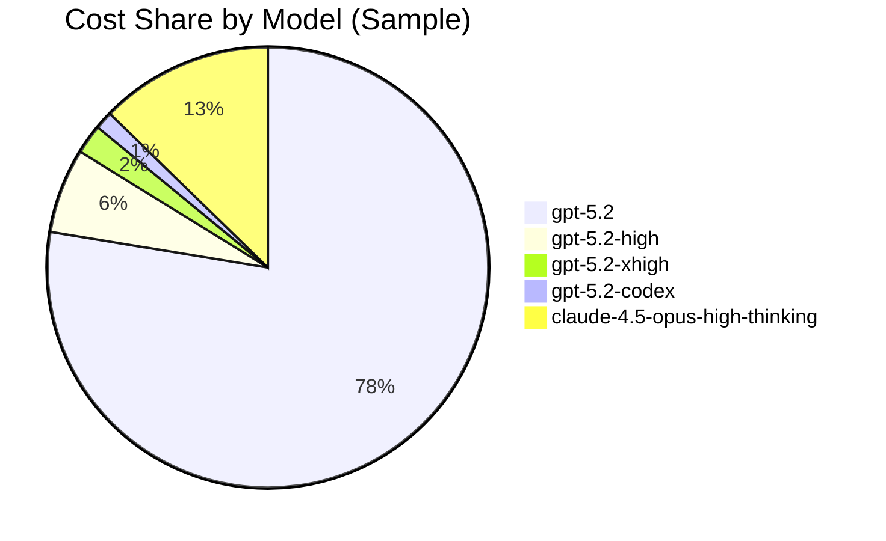
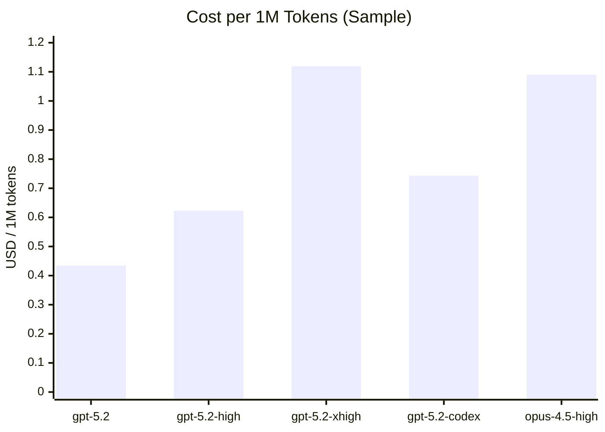
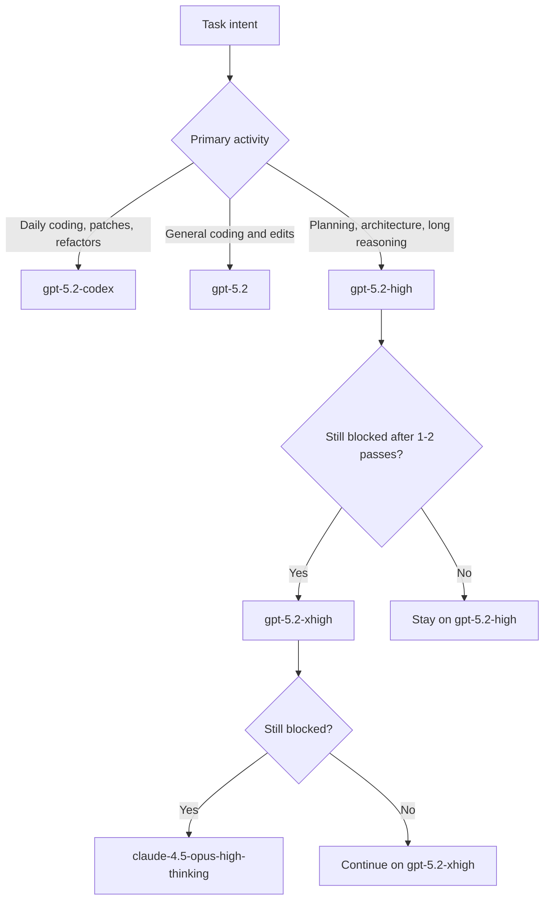

# Model Usage Cost Guidance (Cursor On-Demand)

## Scope and data source

This note summarizes model usage based on the provided on-demand history snippet
(100 rows, Jan 24 to Jan 25). The numbers are a sample and not a complete
30-day export. The purpose is to provide a quick visual guide for daily usage
choices and escalation paths for harder tasks.

## Summary (sample of 100 rows)

- Total tokens: 94.56M.
- Total cost: $46.28.
- Average cost per 1M tokens: $0.489.

### Per-model totals (sample)

| Model | Tokens (M) | Cost (USD) | Cost per 1M tokens |
| --- | --- | --- | --- |
| gpt-5.2 | 82.83 | 35.91 | 0.434 |
| gpt-5.2-high | 4.62 | 2.88 | 0.623 |
| gpt-5.2-xhigh | 0.89 | 1.00 | 1.119 |
| gpt-5.2-codex | 0.82 | 0.61 | 0.743 |
| claude-4.5-opus-high-thinking | 5.39 | 5.88 | 1.090 |

## Visuals

### Cost share by model (sample)

### Cost per 1M tokens by model (sample)

## Decision guide

## Recommendations (based on sample costs)

- Daily default for coding favors `gpt-5.2` or `gpt-5.2-codex` due to the lowest
  observed cost per 1M tokens.
- `gpt-5.2-high` is reserved for planning or when additional reasoning depth is
  required. The observed cost is higher than `gpt-5.2` but still below the
  extra-high and Opus tiers.
- `gpt-5.2-xhigh` is a constrained escalation tier for difficult cases where
  `gpt-5.2-high` fails after one or two passes.
- `claude-4.5-opus-high-thinking` is a last-resort escalation due to the highest
  observed cost per 1M tokens in the sample.

## Update instructions for a full 30-day export

- Replace the per-model totals with full export totals.
- Recompute the cost share chart using the updated per-model costs.
- Recompute the per-model cost per 1M tokens using the updated totals.
