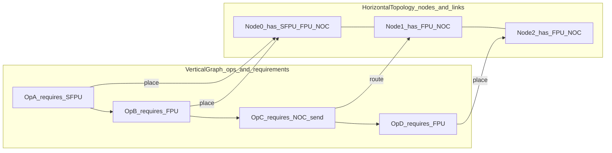

# 06: От вертикального графа вычислений к горизонтальной топологии ресурсов (идеи планировщика)

Эта заметка развивает идею “вертикального дерева/графа алгоритма” и “горизонтального моря одинаковых элементов (cores/threads/links)”
как проекций одной задачи: разложить вычисление на ограниченный набор аппаратных ресурсов с учетом задержек и пропускных способностей.

Цель документа: зафиксировать лексику и минимальные интерфейсы, которые позволят обсуждать (и позже прототипировать) планировщик,
не смешивая “семантику вычислений” и “форму C++/файлов”.

## 1. Две проекции одной системы

### 1.1 Вертикальная проекция: “что нужно сделать”

Это граф (или дерево) вычислений и зависимостей. В терминах MLIR это может быть:

- SSA dataflow граф ops,
- CFG внутри thread-функций,
- явная композиция reader/compute/writer потоков через CB/pipe/semaphore.

Ключ: в этой проекции важно фиксировать **ресурсные требования** (что именно потребляет op):

- compute: FPU vs SFPU, DST pressure, формат/конфиг (CFG),
- data movement: NOC/DMA, CB reserve/push/pop, barriers,
- память: L1/DRAM footprint и lifetimes.

### 1.2 Горизонтальная проекция: “на чем и где это делать”

Это модель целевой топологии (или “виртуального железа”):

- узлы (cores, RISC контексты внутри core, логические execution contexts),
- ресурсы каждого узла (кол-во DST/CB, has_sfpu, каналы NOC),
- связи (latency/bandwidth), включая “соседи”, домены быстрой связи и “медленные” внешние линки.

Важно: горизонтальная модель должна быть параметризуемой, чтобы экспериментировать с разными топологиями.

## 2. Привязка к существующим документам tt-lang

### 2.1 Layered IR как место для “вертикальных” контрактов

Документ `docs/01_Architecture/07_LLD_LayeredIR_TTMetal_LLkDbV2_Validation.md` предлагает слои IR, где:

- семантика и контракты ресурсов (CB/DST/NOC/SFPU/CFG) выражаются явно,
- проверка протоколов выполняется CFG-aware (dataflow по графу управления),
- “форма C++/файлов” появляется поздно.

Это естественная точка, куда можно “подцепить” планировщик:

- планировщик читает “вертикальный” ресурсно-аннотированный граф,
- планировщик выбирает размещение/расписание на топологию,
- результаты плейсмента материализуются как атрибуты/опы, которые downstream lowering уже умеет кодогенерировать.

### 2.2 Симулятор как дешёвый стенд для экспериментов с политиками

Текущий симулятор (`docs/01_Architecture/04_LLD_Simulator.md`) является функциональным:

- моделирует протоколы CB/pipes/semaphores,
- детектирует deadlock,
- не является cycle-accurate моделью NOC/compute.

Идея: “временная” ветка (latency/topology) должна жить как экспериментальный слой поверх функциональной модели:

- сначала проверить корректность протоколов (функциональный сим),
- затем добавить параметризуемые задержки и метрики utilization/stalls (эксперимент).

## 3. Эскиз интерфейса: от графа ops к расписанию

Минимальный набор сущностей (концептуально):

- `OpNode`: операция/шаг с ресурсными требованиями и длительностями (в абстрактных единицах).
- `Edge`: зависимость данных/управления (и требования к коммуникации).
- `ResourceModel`: набор ресурсов узла (DST/CB/NOC/SFPU/CFG).
- `Topology`: граф узлов и связей (lat/bw).
- `Schedule`: отображение `OpNode -> (node_id, start_time, duration)` и `Edge -> (route, send_time, recv_time)`.

## 4. Где возникают “окна простоя” и почему “перетянуть одеяло” может помочь

Симптом: некоторый ресурс (например SFPU, или NOC link) простаивает, потому что зависимость данных “приходит слишком рано/поздно”
или потому что расписание фиксирует жесткий порядок “считать -> отправить -> ждать”.

Два типовых приёма:

- **Delay send**: отложить отправку результатов на несколько ops вперед, чтобы лучше заполнить compute на текущем узле.
- **Compute migrate**: перенести часть вычислений ближе к месту потребления, даже если это меняет коммуникационный профиль.

Ключ: оба приема влияют на latency и throughput по-разному; без модели топологии их нельзя сравнить.

## 5. Диаграмма 1: сопоставление “вертикального” графа и “горизонтальной” топологии

## 6. Диаграмма 2: “delay send” vs “compute migrate” (таймлайн)

```mermaid
sequenceDiagram
  participant N0 as Node0
  participant N1 as Node1

  rect rgb(0,0,0)
  note over N0,N1: Baseline
  N0->>N0: Compute_A
  N0->>N1: Send_X
  N1->>N1: Wait_X
  N1->>N1: Compute_B
  end

  rect rgb(0,0,0)
  note over N0,N1: DelaySend
  N0->>N0: Compute_A
  N0->>N0: Compute_A2
  N0->>N1: Send_X_late
  N1->>N1: Compute_B_late
  end

  rect rgb(0,0,0)
  note over N0,N1: ComputeMigrate
  N0->>N1: Send_inputs
  N1->>N1: Compute_A_on_N1
  N1->>N1: Compute_B_on_N1
  end
```

Примечание: диаграмма намеренно иллюстративна. Реальная модель должна учитывать конкурентный доступ к NOC/CB/DST и протоколы ожиданий.

## 7. Как связать это с текущей моделью tt-lang “grid + 3 kernels”

В текущем interop пути (`python/ttl/ttl_api.py`) есть фиксированная структура “1 compute + 2 DM” и прямоугольный `CoreRangeSet`.
Это означает, что “планировщик поверх топологии” сегодня может рассматриваться в двух режимах:

- **Внутри одного core**: оптимизация формы compute/pack/prefetch (DST pressure, уменьшение частоты глобальных waits).
- **Across cores (grid)**: разбиение workload по cores и возможное изменение схемы коммуникации.

Поддержка произвольной “многоузловой” топологии (не обязательно прямоугольник) требует явного VirtualCluster/Topology слоя (см. следующую заметку `07_*`).

## 8. Дальнейшие шаги (в терминах исследований, не реализации)

- Определить минимальный формат `Topology` (узлы/ресурсы/links) и несколько “эталонных” топологий для бенчмарков.
- Определить метрики: latency, throughput, utilization (FPU/SFPU/NOC), pressure по DST/CB, stall breakdown.
- Связать измерения с существующим профилированием:
  - host-side stage boundaries (Tracy) и cold/warm режимы,
  - device-side cycles (TT-Metal device profiler) где доступно.

