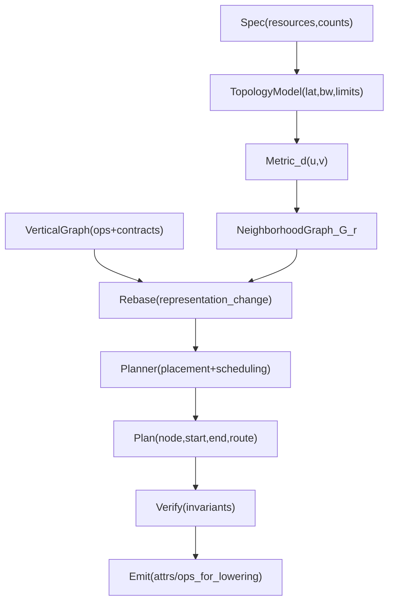
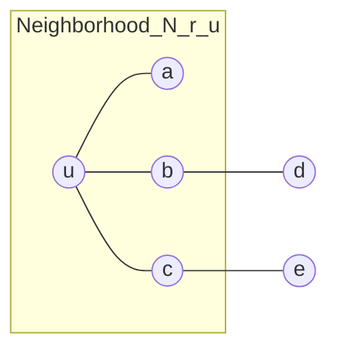

# 08: Ping-neighborhoods как локальные окрестности топологии (и "смена базиса" для маппинга/расписания)

<!--
Исходная формулировка (исправлены опечатки, смысл сохранен):

Перельман доказал гипотезу Пуанкаре, так что любая локально связная штука представима как сфера - так, вроде.

Возьмем эту идею, то есть локально доступные ноды по пингу - как окружности небольшого радиуса в 2D, 3D, ND пространстве,
где раскиданы Tensix cores, и, соответственно, вычислительные блоки, которые и нужны, до которых и следует доставить данные
по алгоритму и по архитектуре маппинга дерева алгоритма на предполагаемую сетку нод - в том смысле, что все количества нод известны,
их устройства в смысле доступных блоков доступны из спецификации.

Еще филдсовскую премию Шольцу дали за то, что он показал, как упрощать доказательства, меняя базис туда, где проще, и обратно,
с доказательствами корректности. Примени эту идею тоже.
-->

## 1. Коротко

Идея: рассматривать "локально доступные по ping" узлы как **метрические окрестности** на графе/многообразии топологии, и строить
маппинг алгоритма на железо через переход в представление, где локальные ограничения и маршрутизация проще выражаются.
Затем "вернуться обратно" в физическое представление, сохранив корректность (инварианты по ресурсам, зависимостям и коммуникациям).

Связанные заметки:
- `docs/ideas/05_ttmetal_execution_model_grid_kernels.md` (текущий interop: grid + 3 kernels).
- `docs/ideas/06_vertical_ir_to_horizontal_topology_scheduler.md` (вертикальный граф вычислений vs горизонтальная топология ресурсов).
- `docs/ideas/07_virtual_cluster_over_physical_hw.md` (VirtualCluster: топология как параметризуемая модель).

## 2. Уточнение про "Пуанкаре => все как сфера" (важно как рамка)

Гипотеза Пуанкаре (доказанная Перельманом) относится к **замкнутым 3-мерным многообразиям**: если такое многообразие
просто связно, то оно гомеоморфно \(S^3\). Это не означает, что "любая локально связная штука" есть "сфера".

Однако как **метафора инженерного мышления** полезна следующая мысль:
- локальные окрестности часто проще (почти евклидовы, "как шарики/окружности");
- сложность появляется в глобальной склейке и в том, какие "швы" и "дыры" возникают при связывании локальных областей.

В нашем контексте "локальность" задается не геометрией в \(\mathbb{R}^n\), а **метрикой задержки/доступности** (ping, hops, bw/lat).

## 3. Модель: узлы, метрика и ping-neighborhoods

Пусть есть множество узлов \(V\) (например Tensix cores, RISC контексты, логические execution contexts). По спецификации известны:
- ресурсы узла (has_sfpu, FPU, DST/CB емкости, NOC каналы/ограничения),
- доступные связи и их параметры (latency/bandwidth/concurrency).

Вводится метрика/квазиметрика "дистанции" \(d(u, v)\), например:
- \(d\) = минимальная задержка по маршруту (shortest path by latency),
- или \(d\) = число hops,
- или комбинированная стоимость \(d = w_\mathrm{lat}\cdot \text{lat} + w_\mathrm{bw}\cdot 1/\text{bw}\) (с оговорками).

Тогда ping-neighborhood узла \(u\) радиуса \(r\) это:
\[
\mathcal{N}_r(u) = \{ v \in V \mid d(u, v) \le r \}.
\]

Это задает:
- локальные домены быстрой связи;
- естественный граф соседства \(G_r=(V,E_r)\), где \(E_r\) соединяет пары, попадающие в окрестности друг друга.

## 4. Применение к маппингу "вертикального" алгоритма на "горизонтальную" топологию

Алгоритм (в вертикальной проекции) можно мыслить как DAG/дерево ops с зависимостями и ресурсными контрактами (см. `06_*`):
- compute требования (SFPU/FPU, DST pressure, формат, CFG),
- data-movement требования (NOC/DMA, буферы, барьеры),
- memory lifetimes (L1/DRAM footprint).

Маппинг на железо с ping-neighborhoods предлагает явный принцип:
- **зависимости с плотной коммуникацией** должны стремиться оставаться внутри небольших \(\mathcal{N}_r\) доменов;
- **границы доменов** (переходы между окрестностями) являются кандидатами для явной оптимизации маршрутизации, упаковки данных,
  и перестройки алгоритма (реассоциации, фьюжн, разбиение фаз DM/compute).

Практически: вместо "прямоугольного grid как данность" (см. `05_*`) можно оперировать:
- VirtualCluster/topology как вход (см. `07_*`),
- neighborhood-графами и покрытиями как удобной промежуточной структурой.

## 5. "Смена базиса" (идея Шольца) как инженерный прием

В инженерном смысле "смена базиса" здесь означает:
- выбрать представление, в котором ограничения проще выражаются или решаются быстрее;
- решить задачу в этом представлении;
- вернуть результат в исходное представление, приложив **доказательство корректности** через сохранение инвариантов.

### 5.1 Примеры "базисов" для одной и той же системы

- **Физический базис**: координаты cores на чипе, реальные NOC пути, реальные ограничения каналов.
- **Топологический/метрический базис**: граф \(G\) с весами (lat/bw), neighborhood-граф \(G_r\), домены/кластеры.
- **Алгоритмический базис**: DAG ops + контракты (ресурсы/зависимости).
- **Коммуникационный базис**: hypergraph потоков данных (какие ребра доминируют по объему/частоте).
- **Инвариантный базис**: набор проверяемых условий (ресурсные лимиты, happens-before для зависимостей, протокольные барьеры).

### 5.2 Что значит "корректность" при переходах

Минимальный набор инвариантов, которые должны сохраняться при смене базиса/обратно:
- **Data dependencies**: для каждого ребра зависимости \(a \to b\) результат \(a\) доступен \(b\) (включая маршрутизацию и буферы).
- **Resource feasibility**: ни на одном узле не превышаются лимиты DST/CB/NOC concurrency в любой момент времени.
- **Protocol correctness**: порядок событий (commit/wait/barrier) остается корректным; нет deadlock.

Идея: доказательство корректности это не "математика ради математики", а формальная проверка этих инвариантов на результате планировщика.

## 6. Эскиз пайплайна: Spec -> Neighborhoods -> План -> Маппинг

## 7. Мини-диаграмма: ping-neighborhood как "шар" в метрике графа

## 8. Набросок практических "следующих вопросов" (без обязательств к реализации)

- Как выбрать метрику \(d\) для целей планирования: latency-only, bw-aware, или эмпирическая модель?
- Как увязать neighborhood-кластеры с текущими ограничениями interop (`05_*`: 1 compute + 2 DM) и ресурсными контрактами (`06_*`)?
- Где лучше встраивать проверку инвариантов: на уровне IR (layered IR) или на уровне симулятора (функциональный + timing слой)?

