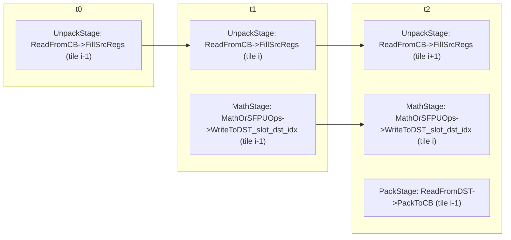

# 03: Tensix (Wormhole/Blackhole) — как работает “параллелизм” SFPU/FPU, DST и почему нужны wait/commit

## Summary

На Tensix core “параллелизм” внутри одного core обычно означает:

- **один последовательный instruction stream** в compute-контексте (в терминах TT/LLK: то, что в итоге превращается в последовательность `TTI_*` макросов для Tensix),
- но при этом **железо** может держать “в полете” разные стадии dataflow-конвейера (**unpack → math/SFPU → pack**) и перекрывать их по тайлам,
- а также позволяет **пайнлайнинг по тайлам** через несколько DST слотов (несколько `dst_idx`/output DST slots до одной точки `tile_regs_commit/wait`),

и это не означает “две независимые SFPU операции одновременно” в смысле двух полностью независимых SFPU execution pipes, которые можно запустить параллельно без hazard/protocol points.

Этот документ собирает в одну картинку:

- почему в LLK часто встречается `WAIT_SFPU`/`STALLWAIT` и почему “разные регистры” не всегда снимают ожидания;
- что именно компилятор tt-lang вставляет в MLIR (`tile_regs_commit/wait`) и зачем;
- какие практические шаблоны (и анти-шаблоны) помогают получить больше перекрытия на Wormhole и Blackhole.

## Goals

- Дать **понятную ментальную модель**: что исполняется последовательно, а что может перекрываться.
- Объяснить термины (DST, `dst_idx`, SFPU, “threads” внутри Tensix, `WAIT_SFPU`).
- Показать **минимальные доказательные фрагменты** из кода tt-lang/tt-metal, чтобы было ясно “почему так”.
- Дать **практические рекомендации**: как писать цепочки MLIR/C++ команд так, чтобы лучше пайплайнить по тайлам и не ломать протокол.

## Non-goals

- Не пытаемся описать весь ISA/микроархитектуру Tensix и все частные случаи.
- Не обещаем, что любой `wait` можно “убрать и станет быстрее”. Многие waits — это защита от реальных hazard’ов (CFG/DST/packer semaphores).
- Не даем гарантий по performance без измерений на конкретном kernel.

## Glossary (простыми словами)

- **Tile**: базовая единица вычислений (обычно 32x32 элементов в TT stack).
- **Tensix core**: вычислительное ядро, которое внутри имеет несколько “подсистем” (в терминах TT microcode/LLK удобно думать про *unpack*, *math/sfpu*, *pack*).
- **Unpack**: стадия, которая подготавливает/подает данные в источники для вычислений (часто из circular buffer в src regs).
- **Math / FPU**: “основной” вычислительный блок (термины зависят от контекста; важно: это compute pipeline).
- **SFPU**: специальный (special function) блок/режим для некоторых операций (exp/log/relu/etc). В коде это часто видно как sfpu-специфичные LLK вызовы и `WAIT_SFPU`.
- **Pack**: стадия, которая забирает результаты и упаковывает/пишет их дальше (например, в circular buffer).
- **DST registers**: аппаратный “банк” destination регистров для хранения тайловых результатов/промежуточных значений.
- **`dst_idx`**: индекс DST слота в рамках вычисления (что-то вроде “какую ячейку DST использовать для этого результата”).
- **Double-buffering DST**: режим, где DST логически делится на две “секции” (условно A/B) и используется конвейерно, чтобы compute (math/SFPU) мог писать результаты в одну секцию, пока pack читает/упаковывает результаты из другой.
  - **Physical capacity**: сколько “DST tiles” физически доступно в банке регистров (часто упоминают 16 как порядок величины, но точные числа зависят от arch/конфига).
  - **Effective capacity**: сколько DST слотов *можно безопасно использовать как “в полете” одновременно* при double-buffering. Обычно это примерно половина physical capacity, потому что в каждый момент времени “активна” только одна секция для writer’а (compute), а вторая секция зарезервирована под reader’а (pack).
  - **Зачем это нужно**: double-buffering делает возможным устойчивое перекрытие стадий по тайлам: пока pack разгружает секцию A, compute уже наполняет секцию B следующими тайлами. Без этого pack и compute чаще вынуждены синхронизироваться “в лоб” и простаивать.
  - **Почему это “capacity”, а не просто “режим”**: выбор режима напрямую ограничивает ILP по DST. Если effective capacity = 8, то держать 12 независимых результатов в DST без раннего `commit/wait` нельзя: либо придется уменьшать unroll/параллелизм по тайлам, либо появятся дополнительные copy/serialization точки.
  - **Как это проявляется в LLK/протоколе**:
    - `tile_regs_commit`/`tile_regs_wait` являются “границами фаз”, в которых происходит согласование math↔pack и (концептуально) переключение/разрешение использования секции.
    - многие “глобальные” ожидания (packer semaphores, `STALLWAIT` вокруг CFG) становятся критичнее именно при double-buffering, потому что pack и compute реально работают конкурентно над разными секциями и нужно строго выдерживать точки, где секции безопасно переиспользовать.
  - **Full-sync (без double-buffering)**: противоположный режим (часто описывают как `dst_full_sync_en=true`) даёт доступ к полной physical DST емкости “как к одному пулу”, но обычно снижает возможность перекрытия compute/pack (больше синхронизации, меньше pipeline overlap). Этот компромисс полезно понимать как tradeoff “больше регистров одновременно” vs “лучше overlap”.
  - **FP32 и другие форматы**: если включается 32-bit storage/accumulation для destination (`fp32_dest_acc_en`/аналогичные knobs), то количество *physical* DST tiles может эффективно уменьшаться (тайл “дороже” по битам). Тогда и effective capacity при double-buffering падает еще сильнее. Авторитетные таблицы по этому поведению и по knobs находятся в TT-Metalium; в tt-lang на это есть ссылка в `docs/sdlc/00_Main/00_Ideas/04_reconfiguration_latency_and_tensix_facts.md`.
- **`tile_regs_acquire/commit/wait/release`**: явные операции/вызовы протокола работы с DST и синхронизации math↔pack.
- **`STALLWAIT` / `WAIT_SFPU`**: низкоуровневые барьеры/ожидания, которые защищают от конфликтов конвейера/CFG/DST/семафоров.

Примечание про слово “thread”: в этих документах это обычно **не** “поток ОС”, а *концептуальная стадия/контекст* (unpack/math/pack) внутри одного Tensix core, синхронизация между которыми идет через семафоры/барьеры и протокол DST.

## Ментальная модель: что может перекрываться

Ниже упрощенная картинка: в одном tile-итераторе compute поток выдает инструкции последовательно, но “железо” может перекрывать работу стадий (например, пока pack упаковывает результат тайла i-1, math/sfpu считает тайл i, а unpack готовит тайл i+1).



В `t2` одновременно заняты 3 “движка”: `unpack`, `math/SFPU`, `pack`.

Ключевая мысль:

- **Внутри MathStage** команды идут последовательно (в смысле “instruction stream”).
- Перекрытие обычно достигается **между стадиями** и **между тайлами**, когда есть несколько DST слотов и правильная синхронизация.

## Что компилятор tt-lang принудительно вставляет и почему

В tt-lang есть pass, который вставляет протокол вокруг тела `ttl.compute`, чтобы соблюсти синхронизацию между math и pack и корректный жизненный цикл DST.

Суть прямо написана в комментарии:

```cpp
// tt-lang/lib/Dialect/TTL/Transforms/TTLInsertTileRegsSync.cpp
// This establishes the correct DST lifecycle per tile:
//   acquire -> [compute] -> commit -> wait -> [pack] -> release
```

А в трассировке lowering’а видно, что в MLIR появляются:

- `ttl.init_sfpu(...)`
- `ttl.tile_regs_acquire`
- внутри цикла: `ttl.tile_regs_commit` → `ttl.tile_regs_wait` → `ttl.store` (pack)
- `ttl.tile_regs_release`

См. `docs/sdlc/00_Main/03_Specs/LOWERING_MULTITILE.md` (раздел “Stage 4: ttl-insert-tile-regs-sync”).

### Почему `commit` и `wait` разделены

На практике `commit` — это “объявить pack’еру/протоколу: у math есть готовые результаты в DST”, а `wait` — “дождаться, что можно безопасно читать/паковать DST (и/или что есть место/правильный DST section)”.

Снаружи это выглядит как шаблон:

- произвести вычисления в DST (в разных `dst_idx`);
- один раз `commit`;
- один раз `wait`;
- потом пакетно `pack_tile(...)` (один или несколько раз).

## Что “микроядро” (LLK) вынуждено ждать: примеры из tt-metal

### Wormhole: конфиг/форматы часто требуют `WAIT_SFPU`

В Wormhole LLK часто ждет `WAIT_SFPU` при CFG операциях, чтобы не менять конфигурацию, пока SFPU/Math в опасном состоянии:

```cpp
// tt-metal/tt_metal/third_party/tt_llk/tt_llk_wormhole_b0/llk_lib/llk_math_common.h
TTI_STALLWAIT(p_stall::STALL_CFG, p_stall::MATH | p_stall::WAIT_SFPU);
```

Также синхронизация с pack’ером выражена через семафоры и флаги ожиданий, которые завязаны на SFPU:

```cpp
// tt-metal/tt_metal/third_party/tt_llk/tt_llk_wormhole_b0/common/inc/cmath_common.h
TTI_SEMWAIT(p_stall::STALL_MATH | p_stall::STALL_SFPU, semaphore::t6_sem(semaphore::MATH_PACK), p_stall::STALL_ON_MAX);
t6_semaphore_post<p_stall::MATH | p_stall::WAIT_SFPU>(semaphore::MATH_PACK);
```

### Blackhole: конфиг отличается, но hazard’ы остаются

Blackhole отличается в деталях конфигурации. Например, `_llk_math_hw_configure_` ждет только MATH:

```cpp
// tt-metal/tt_metal/third_party/tt_llk/tt_llk_blackhole/llk_lib/llk_math_common.h
TTI_STALLWAIT(p_stall::STALL_CFG, p_stall::MATH);
```

Но SFPU-специфичные “start” точки все равно синхронизируются с MATH, потому что это общий pipeline/hazard:

```cpp
// tt-metal/tt_metal/third_party/tt_llk/tt_llk_blackhole/llk_lib/llk_math_eltwise_unary_sfpu.h
TTI_STALLWAIT(p_stall::STALL_SFPU, p_stall::MATH);
```

## Почему “если разные dst_idx/регистры — можно параллельно” не всегда верно

Важно разделять **две разные причины ожиданий**:

1) **Алиасинг данных в DST** (да, если ты пишешь/читаешь один и тот же `dst_idx`, то без sync легко получить race).

2) **Глобальные hazard’ы конвейера** (CFG/packer semaphores/DST section flip): они не про “какой DST индекс”, а про то, что:

- нельзя менять конфигурацию “на лету”, пока pipeline не в безопасном состоянии;
- нельзя дать pack читать DST, пока math еще не “committed” результаты или пока pack занят/нет места;
- в double-buffering режимах есть логика переключения половины DST (условно “section flip”), которая требует строгих точек синхронизации.

Отсюда практический вывод:

- “Разные регистры” помогают **увеличить ILP** (несколько результатов готовы одновременно), но **не отменяют** необходимость `commit/wait` и некоторых `WAIT_SFPU` вокруг конфигов.

## “SFPU lock”: что это такое, как проверить, и можно ли “выключить”

Интуитивное описание “SFPU залочен” обычно означает одно из двух:

- **(A) Hazard wait в LLK**: в реальных LLK заголовках встречаются барьеры вида `TTI_STALLWAIT(... WAIT_SFPU ...)`, которые обеспечивают безопасные точки для CFG/пайплайна (см. примеры Wormhole в этом документе).
- **(B) Протокольное ожидание math↔pack/DST**: ожидания `tile_regs_commit/wait` и связанные семафоры/барьеры. Это не “лок” SFPU как отдельного устройства, а часть общего протокола конвейера и DST lifecycle.

### Как проверить “что именно блокирует”

#### 1) Проверка на уровне LLK/ISA (причина A)

Если нужно понять, что ожидания приходят из LLK:

- найти в LLK соответствующей arch строки `WAIT_SFPU`/`STALLWAIT` (Wormhole пример уже приведен выше);
- помнить, что это **arch-specific**: на Blackhole отдельные места могут ждать только `MATH`, но SFPU-старт точки все равно синхронизируются с MATH.

Практический смысл: эти ожидания являются частью корректности (hazard protection), а не “опциональной оптимизацией”.

#### 2) Проверка на уровне MLIR lowering (причина B)

Для tt-lang можно проверить, что компилятор вставляет SFPU/DST lifecycle и что частота ожиданий определяется формой IR:

- В `docs/sdlc/00_Main/03_Specs/LOWERING_MULTITILE.md` явно показано, что pass `ttl-insert-tile-regs-sync` вставляет `ttl.init_sfpu`, `ttl.tile_regs_acquire/release` и `ttl.tile_regs_commit/wait`.
- В lit-тестах lowering присутствуют проверки `ttl.init_sfpu(...)` (см. `test/ttlang/Dialect/TTL/Transforms/*`).

Если `ttl.tile_regs_commit/wait` стоит внутри tight loop на каждый тайл, это **сознательная точка синхронизации** в текущем lowering (и она ограничивает перекрытие).

#### 3) Проверка на уровне сгенерированного C++ (косвенная)

В generated C++/ttkernel коде наличие `init_sfpu(...)` обычно является индикатором, что SFPU path инициализируется и протокол DST lifecycle активен.

### Можно ли “выключить” (и что реально настраивается)

- **Нельзя безопасно “выключить” hazard waits в LLK** (типа `WAIT_SFPU`) просто “потому что SFPU свободен”. Эти ожидания защищают CFG/пайплайн и корректность взаимодействия стадий. Удаление таких барьеров в общем случае превращает проблему из “stall” в “silent data corruption”.

- **Можно уменьшать частоту глобальных wait точек**, меняя *форму программы*:
  - минимизировать CFG reconfiguration в горячем цикле (см. рекомендацию выше);
  - организовывать compute так, чтобы `commit/wait` приходились на “пачку” тайлов, а не на каждый микрошаг.

- **Есть высокоуровневый компромисс DST full-sync vs double-buffering**, который влияет на доступную емкость DST и на стиль перекрытия compute/pack. Это не “выключение SFPU”, а выбор режима синхронизации/буферизации DST; авторитетный источник и таблица — TT-Metalium (см. `docs/sdlc/00_Main/00_Ideas/04_reconfiguration_latency_and_tensix_facts.md`).

### Что насчет “define, который лочит SFPU”

В tt-lang дереве не найдено управляемого `#define`, который бы “отключал WAIT_SFPU”. На практике “лок” чаще является следствием:

- arch-specific LLK макросов/барьеров (`STALLWAIT(... WAIT_SFPU ...)`), или
- протокольной синхронизации DST/packer (semaphores/commit/wait).

Если где-то в сторонней ветке/эксперименте встречается `#define`, то это, скорее всего, относится к выбору LLK конфигурации/варианта сборки, а не к уровню DSL/MLIR tt-lang.

## Как реально “выжать параллелизм”: практические рекомендации

### 1) Пайнлайнинг по тайлам: держать несколько тайлов “в полете”

Цель: пока pack допаковывает результат тайла i-1, math/sfpu уже считает тайл i.

Для этого обычно нужно:

- не делать “ранний wait” после каждой микро-операции;
- давать накапливаться нескольким готовым DST слотам.

**Анти-паттерн** (слишком частые барьеры):

- вычислили один тайл → `wait` → `pack` → следующий тайл.

**Лучше**:

- вычислить N тайлов, записав результаты в разные output DST слоты,
- один раз `commit`,
- один раз `wait`,
- упаковать N тайлов.

Это ровно то, что tt-lang иллюстрирует в `docs/sdlc/00_Main/03_Specs/LOWERING_MULTITILE.md` и в примерах `docs/sdlc/00_Main/03_Specs/DST_Allocation.md` (там показан fully-unrolled случай, где пачка `pack_tile` идет после одного `commit/wait`).

### 2) DST ILP через `dst_idx` + unroll

Если у тебя есть несколько output DST слотов, ты можешь:

- писать результаты тайлов \(i, i+1, ...\) в разные `dst_idx` (или разные “output region” DST слоты при unroll),
- затем паковать их пачкой.

Это увеличивает вероятность перекрытия math/sfpu и pack.

Ограничение: **емкость DST** зависит от режима и datatype.

В `docs/sdlc/00_Main/03_Specs/LOWERING_MULTITILE.md` есть практическая шпаргалка:

- физически DST может быть 16 “tiles”, но при double-buffering эффективная емкость часто 8;
- для fp32 в некоторых режимах емкость меньше (пример в доке: “8 physical / 4 effective” при double-buffering).

### 3) Минимизировать CFG reconfig в горячем цикле

CFG операции нередко требуют `STALLWAIT` (а на Wormhole — и `WAIT_SFPU`). Если внутри tight loop дергать reconfig, можно убить пайплайнинг.

Практика:

- по возможности выносить форматные/режимные настройки “наружу” (init/epilogue), а не на каждый тайл;
- избегать переключений, которые требуют глобального ожидания конвейера.

### 4) Не нарушать `commit -> wait -> pack`

Даже если кажется, что “все готово”, `commit/wait` защищают общий протокол math↔pack.

Правило большого пальца:

- если следующая стадия **читает результат** (pack/store), то где-то должен быть `wait` (явный или протокольный);
- если ты меняешь конфиг/режимы, где в LLK стоит `STALLWAIT(... WAIT_SFPU ...)`, то это обычно не “косметика”, а обязательное условие корректности.

## Примеры “на пальцах” (псевдо-последовательности)

### Пример A: пакетирование после одного `commit/wait`

Псевдо-C++ (идея, не буквальный API):

```text
tile_regs_acquire();

// compute for multiple tiles, outputs go to different dst slots
compute_tile_to_dst(/*tile=*/0, /*dst=*/Dst2);
compute_tile_to_dst(/*tile=*/1, /*dst=*/Dst3);
compute_tile_to_dst(/*tile=*/2, /*dst=*/Dst4);
compute_tile_to_dst(/*tile=*/3, /*dst=*/Dst5);

tile_regs_commit();
tile_regs_wait();

pack_tile(Dst2, /*out=*/0);
pack_tile(Dst3, /*out=*/1);
pack_tile(Dst4, /*out=*/2);
pack_tile(Dst5, /*out=*/3);

tile_regs_release();
```

Ключ: **между тайлами нет лишних wait**, а `pack_tile` идет после `commit/wait`.

### Пример B: “слишком ранний wait” как анти-паттерн

```text
for each tile:
  compute_tile_to_dst(tile, Dst2)
  tile_regs_commit()
  tile_regs_wait()
  pack_tile(Dst2, tile)
```

Это может снижать перекрытие (pack не успевает “догонять” pipeline, потому что compute постоянно ждет).

## Примечания по Wormhole vs Blackhole (что стоит “по умолчанию” предполагать)

- **Wormhole**: чаще увидишь `WAIT_SFPU` вокруг CFG и семафорной синхронизации. Это означает, что некоторые конфиги и протокольные точки являются “глобальными” и не убираются простым разнесением по `dst_idx`.
- **Blackhole**: конфиг и форматные детали отличаются (например, ALU format может “инфериться”), но SFPU все равно является частью compute pipeline, и есть обязательные точки синхронизации с MATH/PACK.

## Куда смотреть дальше (опорные документы/код)

- `docs/00_ForKids.md`: базовые термины MLIR/пайплайна (SSA/dialect/pass/lowering).
- `docs/sdlc/00_Main/03_Specs/LOWERING_MULTITILE.md`: трассировка lowering до `ttkernel.*`, включая вставку `tile_regs_commit/wait`.
- `docs/sdlc/00_Main/03_Specs/DST_Allocation.md`: как назначается `dst_idx`, почему появляются копии, и как unroll использует DST емкость.
- `lib/Dialect/TTL/Transforms/TTLInsertTileRegsSync.cpp`: реальная логика вставки `init_sfpu` и `tile_regs_*`.
- LLK (tt-metal) для “почему есть wait”:
  - Wormhole: `tt_metal/third_party/tt_llk/tt_llk_wormhole_b0/llk_lib/llk_math_common.h`, `.../common/inc/cmath_common.h`
  - Blackhole: `tt_metal/third_party/tt_llk/tt_llk_blackhole/llk_lib/llk_math_common.h`, `.../llk_math_eltwise_*_sfpu.h`
