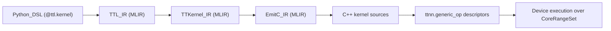

# 05: Модель исполнения TT-Lang/TTNN interop: grid, kernels и RISC контексты Tensix

Эта заметка фиксирует текущую (as-implemented) ментальную модель исполнения, чтобы избегать неправильных ожиданий вида
“любой вызванный op автоматически запускается на всех Tensix cores” или “внутри Tensix есть 5 RISC и один из них делает compute”.

Здесь рассматривается именно путь `tt-lang` Python DSL -> MLIR lowering -> `ttnn.generic_op` (interop).

## 1. Что порождает tt-lang (сверху вниз)

Типовой поток артефактов (сильно упрощено):

Практическая точка входа и граница ответственности описаны в:

- `docs/sdlc/00_Main/02_Architecture/03_LLD_RuntimeAndPythonAPI.md`
- `docs/sdlc/00_Main/02_Architecture/02_LLD_CompilerPipeline.md`

## 2. Kernels, “threads” и текущее ограничение interop: ровно 3 kernels

В текущем TTNN interop tt-lang ожидает ровно **3 kernels**:

- **1 compute kernel**
- **2 data movement kernels** (reader и writer)

Это явно проверяется в `python/ttl/ttl_api.py` (см. блок “Validate kernel count”):

- “TTNN interop requires exactly 3 kernels (1 compute + 2 data movement)”
- мотивация: “Each core has only 2 NOCs, so more than 2 DM kernels causes NOC conflicts.”

Следствие: модель исполнения “один op = произвольное число kernel’ов” сейчас **не реализована** в interop пути.
Если lowering порождает “лишние” bounce kernels (например из-за смешения host tensors и TTNN tensors), interop падает с диагностикой.

## 3. Grid: на каких cores выполняется (и почему это не “все Tensix cores”)

Вызов `@ttl.kernel(grid=(cols, rows))` задаёт прямоугольный диапазон cores, на которых будет выполняться программа.
На уровне interop это превращается в `CoreRangeSet` (от `CoreCoord(0,0)` до `CoreCoord(cols-1, rows-1)`).

Ключевой вывод:

- “Запуск на железе” происходит **на выбранном core range**, а не “автоматически на всех cores на чипе”.
- При этом на каждом core в выбранном диапазоне выполняется **одна и та же** тройка kernel’ов (compute/reader/writer) с локальными параметрами/адресацией.

## 4. Внутри одного Tensix core: какие RISC контексты участвуют

Аппаратные детали (в рамках того, что нужно для ментальной модели) полезно фиксировать на уровне “какие бинарники где исполняются”.
TT-Metalium указывает, что compute kernel компилируется в **три отдельных бинарника**, каждый исполняется на соответствующем RISC-V ядре (T0–T2) внутри Tensix core и требует явной синхронизации между компонентами.

Источник: `docs/sdlc/00_Main/00_Ideas/04_reconfiguration_latency_and_tensix_facts.md` (со ссылкой на TT-Metalium).

Важно:

- Это описание про **пер-core** организацию исполнения (в рамках одного Tensix).
- Это не означает, что “все cores запускают только один выбранный RISC контекст”. Скорее, один и тот же kernel/program распараллеливается по множеству cores, и на каждом core задействуются соответствующие контексты.

## 5. Компиляция и повторное использование: “каждый op компилируется” vs кэш

Интуиция “каждый вызванный op приводит к компиляции kernel’а” неверна как минимум в двух смыслах:

1) **Есть кэш компиляции внутри wrapper’а**: `docs/sdlc/00_Main/02_Architecture/03_LLD_RuntimeAndPythonAPI.md` описывает, что wrapper делает cache key по свойствам аргументов и переиспользует уже скомпилированный результат при cache hit.

2) **Есть различие между host-side и device-side стадиями**:
   - host-side: построение MLIR, запуск pass pipeline, генерация C++ kernel sources, взаимодействие с JIT/кэшами;
   - device-side: загрузка/подготовка program и первый запуск (cold) vs повторный запуск (warm).

Практические метрики и “reconfiguration latency” обсуждаются в:

- `docs/sdlc/00_Main/00_Ideas/04_reconfiguration_latency_and_tensix_facts.md`
- `docs/sdlc/00_Main/03_Specs/PROFILING.md`

## 6. Как правильно отвечать на вопрос “что исполняется параллельно”

Полезно разделять три уровня параллелизма:

- **Across cores (grid-level)**: одинаковая программа выполняется на множестве cores в `CoreRangeSet`.
- **Within one core (RISC контексты + pipeline)**: внутри одного Tensix core “параллелизм” не означает два независимых compute instruction streams. Обычно это один логический instruction stream на compute-стороне, но с перекрытием стадий конвейера (unpack → math/SFPU → pack) и пайнлайнингом по тайлам через DST slots, при этом корректность держится на протоколах CB/DST и точках синхронизации (`tile_regs_*`, семафоры, `STALLWAIT`/`WAIT_SFPU` в LLK).
- **Instruction-level/hazard-level**: часть задержек выглядит как “лок” (например `WAIT_SFPU`), но на практике это hazard/protocol points (см. `docs/sdlc/00_Main/00_Ideas/03_tensix_sfpu_fpu_pipelining_dst.md`).

## 7. Открытый вопрос (future work): “любой алгоритм -> произвольное разбиение kernels”

Текущая реализация interop ограничивает структуру до “1 compute + 2 DM”.
Если цель — поддержать произвольное количество kernels и более сложные разбиения (например несколько DM потоков или несколько compute фаз),
то требуется явная модель маппинга kernels на ограниченные аппаратные каналы (включая NOC конфликты) и, вероятно, планировщик.

Эта тема связывается с идеями “вертикальный граф вычислений” vs “горизонтальная топология ресурсов” (см. следующую заметку `06_*`).

