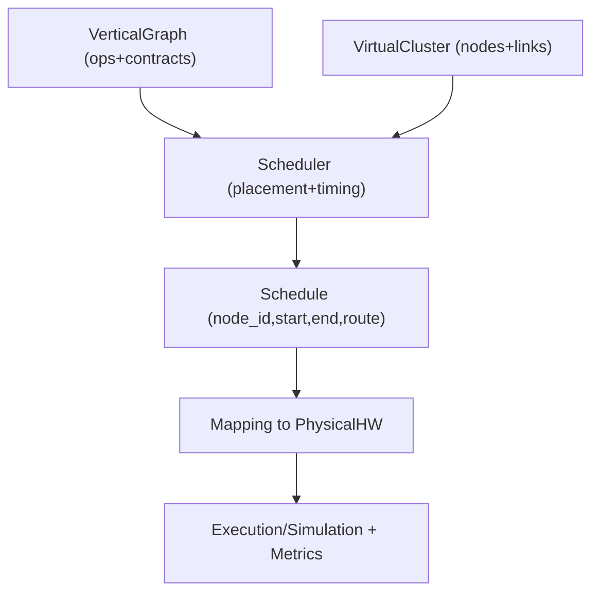

# 07: VirtualCluster: виртуальная топология поверх реального железа (для планирования и бенчмарков)

Эта заметка фиксирует идею “EC2-like выбора железа” и расширяет её до инженерно полезного механизма:
задавать виртуальную топологию (VirtualCluster), а затем отображать её на заданное физическое железо.

Зачем: чтобы системно сравнивать стратегии разбиения/расписания и понимать, как latency/throughput зависят от топологии.

## 1. Интуиция: “натянуть” виртуальную систему на физическую

VirtualCluster описывает:

- сколько есть “узлов” вычисления,
- какие ресурсы у каждого узла,
- как узлы соединены (latency/bandwidth),
- какие ограничения конкуренции (например число NOC каналов, доступность SFPU, DST/CB емкости).

Mapping описывает:

- как виртуальные узлы отображаются на физические cores/контексты,
- как виртуальные каналы отображаются на реальные коммуникационные пути,
- какие виртуальные события “сжимаются” в локальные (если несколько виртуальных узлов мапятся на один физический).

## 2. Минимальная спецификация VirtualCluster (концептуально)

Минимальный набор полей (без привязки к формату файла):

- `nodes`: список узлов.
  - `node_id`
  - `resources`: например `has_sfpu`, `num_dst`, `num_cb`, `num_noc_channels`
- `links`: граф связей.
  - `(src_node_id, dst_node_id)`
  - `latency`
  - `bandwidth`
  - `concurrency_limit` (опционально)
- `routing`: политика маршрутизации (опционально, если граф не полный).

Примечание: ресурсы должны быть достаточны для “грубого” моделирования stall’ов:
например, если `num_noc_channels=2`, то одновременные DM потоки >2 должны конфликтовать.

## 3. Два предельных режима (полезные “стресс-тесты”)

### 3.1 Минимальный кластер: один узел и “все по 1”

Цель: проверить базовую корректность модели и то, что планировщик не полагается на “бесконечные ресурсы”.

- 1 node
- 1 compute context
- минимальные ресурсы DST/CB
- 0/1 link (неважно)

Ожидаемое поведение: планировщик должен деградировать к почти последовательному исполнению и диагностировать дефицит ресурсов
если граф требует больше (например слишком много live tiles в DST).

### 3.2 Гипер-распределенный кластер: “миллиард узлов”

Цель: сделать видимой зависимость latency/throughput от топологии и стратегии размещения:

- очень много узлов,
- неоднородные links (локальные быстрые домены, дальние медленные),
- “датацентры” как кластеры узлов с быстрыми связями внутри.

Ожидаемое поведение: может оказаться, что оптимальное разложение действительно “змейкой” распределяет вычисление по множеству узлов,
или наоборот концентрирует шаги в быстрых доменах, чтобы минимизировать дальние пересылки.

## 4. Что именно измерять (и почему это связано с топологией)

Две главные метрики:

- **Latency**: время получения результата одного запроса/одного “batch item”.
- **Throughput**: устойчивый темп обработки при потоке задач.

Но для дебага/анализа стратегии нужны разложения:

- utilization по ресурсам: `FPU`, `SFPU`, `NOC`, `DST`, `CB`,
- stall breakdown: ожидания по данным, ожидания по протоколам (commit/wait), конфликт каналов,
- memory footprint во времени (L1/DRAM) как ограничение на допустимое параллельное “окно”.

Тезис: даже при фиксированном графе вычислений, разные VirtualCluster и mapping дают разные bottlenecks,
а значит разные оптимальные расписания.

## 5. “Виртуальное железо больше физического”: что реально возможно

Утверждение “можно эмулировать железо, которого больше” корректно только в определенном смысле:

- можно виртуализировать **план/расписание**, то есть смоделировать, что “если бы было больше независимых устройств, то мы бы распараллелили вот так”;
- затем это расписание “упаковывается” на реальное железо, создавая очередь и дополнительные ожидания.

Это полезно как инструмент:

- поиска верхней границы ускорения,
- сравнения политик планирования,
- выявления “скрытых” зависимостей, которые мешают распараллеливанию даже при бесконечных ресурсах (например протокольные hazard points).

Но это не означает, что на реальном устройстве можно “материализовать” больше SFPU/FPU, чем физически существует.

## 6. Где это могло бы жить в tt-lang (без обязательств по реализации)

Логическое место для прототипирования:

- экспериментальная “timing/topology” надстройка над симулятором:
  - функциональная корректность уже описана в `docs/sdlc/00_Main/02_Architecture/04_LLD_Simulator.md`,
  - timing/topology модель должна быть отдельным слоем, чтобы не ломать инварианты функционального симулятора.

Связанный дизайн-ориентир:

- layered IR подход для ресурсных контрактов и поздней эмиссии:
  - `docs/sdlc/00_Main/02_Architecture/07_LLD_LayeredIR_TTMetal_LLkDbV2_Validation.md`

## 7. Связь с текущей моделью “grid + 3 kernels”

Сегодня interop путь фиксирует:

- прямоугольный `CoreRangeSet` (grid),
- ровно 1 compute + 2 DM kernels,
- ограничения “2 NOCs per core” как мотивацию.

VirtualCluster может использоваться как надстройка:

- `grid` становится частным случаем топологии (регулярная решетка),
- более сложная топология требует явного routing/concurrency моделирования,
- эксперименты “какой план был бы идеален на другой топологии” можно выполнять до того, как появится реальная реализация на устройстве.

## 8. Mermaid: схема VirtualCluster -> Mapping -> Execution

