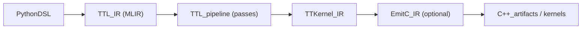

# TT-Lang + MLIR: быстрый технический ввод (00_Quickstart)

## Для кого и зачем

Этот файл предназначен для тех, кто:

- впервые видит `tt-lang`;
- слышал слово “MLIR”, но не умеет быстро читать IR;
- хочет за 10–20 минут понять, **как устроен поток компиляции**, где искать код, и как отлаживать типовые проблемы.

Цель: дать **минимум терминов**, но достаточно, чтобы:

- понимать существующие документы (например `docs/LOWERING_MULTITILE.md`);
- читать IR в тестах и диагностиках;
- понимать, почему “сломался pass”.

## 1) Что такое tt-lang (в одном абзаце)

`tt-lang` — Python DSL для описания kernel-подобных программ (compute + data movement), которые компилируются в MLIR, затем по pipeline преобразуются в более низкоуровневые представления (например TTKernel/EmitC), и далее используются для генерации/запуска артефактов через `ttnn` (или через симулятор).

Под капотом tt-lang опирается на **tt-mlir**: он предоставляет MLIR диалекты, passes и инфраструктуру (LLVM/MLIR toolchain), на которые tt-lang “надевает” Python API.

## 2) MLIR за 10 минут (ровно то, что нужно)

### 2.1 Операции, SSA и типы

MLIR — это “программа как список операций”. Каждая операция:

- имеет **операнды** (входы),
- производит **результаты** (выходы),
- имеет **типы**,
- может иметь **атрибуты** (compile-time metadata).

В MLIR используется SSA: каждое значение “присваивается один раз” и имеет имя вроде `%0`, `%result`, `%11`.

Короткий пример:

```mlir
%c0 = arith.constant 0 : index
%x = ttl.cb_wait %cb0 : ... -> tensor<2x2x!ttcore.tile<32x32, bf16>>
```

- `%c0` — SSA значение типа `index`.
- `%x` — результат операции `ttl.cb_wait`, тип — тензор из тайлов.

### 2.2 Атрибуты

Атрибут — это “наклейка” на операции/функции: он влияет на компиляцию, но не является входным значением SSA.

```mlir
%y = ttl.tile_add %a, %b {dst_idx = 0 : i32} : !ttcore.tile<32x32, bf16>
```

`dst_idx` — атрибут, который помогает связывать операцию с распределением DST регистров.

### 2.3 Регионы и блоки (почему это важно)

Некоторые операции содержат **region** (вложенную “подпрограмму”), а region состоит из **blocks**.

Это важно потому, что:

- region задает вычисление “как шаблон” (например `ttl.compute`),
- blocks задают control-flow и аргументы region’ов.

Пример (очень упрощенно):

```mlir
%out = ttl.compute ins(%a, %b : ...) outs(%c : ...) {iterator_types = ["parallel"]} {
^bb0(%ta: !ttcore.tile<32x32, bf16>, %tb: !ttcore.tile<32x32, bf16>, %tc: !ttcore.tile<32x32, bf16>):
  %r = ttl.tile_add %ta, %tb : !ttcore.tile<32x32, bf16>
  ttl.yield %r : !ttcore.tile<32x32, bf16>
} -> tensor<2x2x!ttcore.tile<32x32, bf16>>
```

#### 2.3.1 Разбор примера `ttl.compute` (как это читать быстро)

Ниже тот же пример, но “размеченный” смыслом:

```mlir
%out = ttl.compute
        ins(%a, %b : ...)                // входные tensors (на уровне тензоров/тайлов)
       outs(%c : ...)                    // destination/output tensor (DPS-стиль: “пишем в out”)
       {iterator_types = ["parallel"]} { // как интерпретировать измерения (упрощенно: параллельный обход)

^bb0(%ta: !ttcore.tile<32x32, bf16>,     // block args: по одному tile на каждую позицию
     %tb: !ttcore.tile<32x32, bf16>,
     %tc: !ttcore.tile<32x32, bf16>):   // часто есть и “out tile”/dst tile аргумент

  %r = ttl.tile_add %ta, %tb : !ttcore.tile<32x32, bf16> // вычисление на одном tile
  ttl.yield %r : !ttcore.tile<32x32, bf16>               // “вернуть” tile-результат наружу

} -> tensor<2x2x!ttcore.tile<32x32, bf16>>               // итог: тензор из 2x2 tiles
```

Ключевые куски:

- **`%out = ...`**: как обычно в SSA, операция возвращает значение и оно получает имя `%out`.
- **`ttl.compute`**: операция с **region** (вложенным телом), которая описывает вычисление *шаблоном*.
  - на вход даются “большие” значения (тензоры из тайлов),
  - внутри region вычисление делается на уровне **одного tile**.
- **`ins(... )`**:
  - список входов (обычно тензоры, например `tensor<2x2x!ttcore.tile<...>>`),
  - `: ...` в примере скрывает подробную сигнатуру/типы ради краткости.
- **`outs(... )`**:
  - destination/output (часто это буфер/тензор под запись),
  - это делает форму похожей на “outs(...)” из linalg-операций: “операция пишет результат в заданное место”.
- **`{iterator_types = ["parallel"]}`**:
  - атрибут, который описывает семантику итераторов/измерений вычисления,
  - в упрощенном чтении можно воспринимать как “по всем элементам/тайлам идём параллельно”.
- **`{ ... }` (region)**:
  - тело вычисления, которое будет применяться к каждой “точке итерации”.
- **`^bb0(...)`**:
  - это **block** внутри region.
  - **block args** (например `%ta`, `%tb`) — это “локальные” входы тела: по одному tile на текущую позицию.
  - `%tc` часто соответствует destination tile (куда писать), даже если в упрощенном примере он не используется.
- **`ttl.tile_add`**:
  - это уже *tile-level* операция: входы и выходы типа `!ttcore.tile<32x32, bf16>`.
- **`ttl.yield`**:
  - “вернуть” значение из region наружу (как `linalg.yield` в `linalg.generic`).
- **`-> tensor<2x2x!ttcore.tile<...>>`**:
  - результат всей операции: снова “большой” тензор из тайлов.

Практическая эвристика (как быстро читать):

- Смотри сначала на **конец строки** (`-> ...`): какой тип получается.
- Потом на **`ins/outs`**: сколько входов и есть ли destination.
- Потом на **`^bb0(...)`**: какие tile-типы реально участвуют в вычислении.
- И только потом на тело (обычно 1–5 tile-ops + `yield`).

### 2.4 Диалекты и lowering

**Диалект** — это “словарь операций и типов”. Разные уровни абстракции часто живут в разных диалектах.

**Lowering** — это перевод из одного словаря/формы в другой (более “конкретный”), через последовательность passes.

## 3) Конкретный поток в tt-lang (от Python до артефактов)

Высокоуровневая картинка:



Где это определяется/живёт:

- **Python вход**: `python/ttl/ttl.py`, `python/ttl/ttl_api.py`
- **Pipeline**: `lib/Dialect/TTL/Pipelines/TTLPipelines.cpp`
- **CLI драйверы**: `tools/ttlang-opt/ttlang-opt.cpp`, `tools/ttlang-translate/ttlang-translate.cpp`
- **Runtime glue**: `python/ttl/kernel_runner.py`

## 4) Минимальный пример end-to-end (Python + кусок IR)

В `docs/LOWERING_MULTITILE.md` есть эталонная трассировка “2x2 add” от Python до IR и дальше. Ниже — минимальный фрагмент, чтобы “узнать форму”.

### 4.1 Python идея (сокращенно)

```python
from ttl import ttl, make_circular_buffer_like
from ttl.ttl_api import Program

@ttl.kernel(grid=(1, 1))
def add_kernel(lhs, rhs, out):
    lhs_cb = make_circular_buffer_like(lhs, shape=(2, 2), buffer_factor=2)
    rhs_cb = make_circular_buffer_like(rhs, shape=(2, 2), buffer_factor=2)
    out_cb = make_circular_buffer_like(out, shape=(2, 2), buffer_factor=2)

    @ttl.compute()
    def add_compute():
        l = lhs_cb.wait()
        r = rhs_cb.wait()
        o = out_cb.reserve()
        o.store(l + r)
        lhs_cb.pop(); rhs_cb.pop(); out_cb.push()

    # ... datamovement threads ...
    return Program(add_compute, dm_read, dm_write)(lhs, rhs, out)
```

### 4.2 Как это выглядит в TTL IR (узнаваемые куски)

```mlir
%lhs = ttl.cb_wait %0 : ... -> tensor<2x2x!ttcore.tile<32x32, bf16>>
%rhs = ttl.cb_wait %1 : ... -> tensor<2x2x!ttcore.tile<32x32, bf16>>
%out = ttl.cb_reserve %2 : ... -> tensor<2x2x!ttcore.tile<32x32, bf16>>

%res = ttl.add %lhs, %rhs : tensor<2x2x!ttcore.tile<32x32, bf16>>, tensor<2x2x!ttcore.tile<32x32, bf16>>
                     -> tensor<2x2x!ttcore.tile<32x32, bf16>>
```

### 4.3 Ключевая граница: `convert-ttl-to-compute`

Идея: “tensor-level add” превращается в compute-region с “tile-level add”.

```mlir
%t = ttl.compute ins(%lhs, %rhs : ...) outs(%out : ...) {iterator_types = ["parallel", "parallel"]} {
^bb0(%a: !ttcore.tile<32x32, bf16>, %b: !ttcore.tile<32x32, bf16>, %o: !ttcore.tile<32x32, bf16>):
  %r = ttl.tile_add %a, %b : !ttcore.tile<32x32, bf16>
  ttl.yield %r : !ttcore.tile<32x32, bf16>
} -> tensor<2x2x!ttcore.tile<32x32, bf16>>
```

## 5) Pipeline: что именно запускается (порядок важен)

Источник истины: `lib/Dialect/TTL/Pipelines/TTLPipelines.cpp` (pipeline `ttl-to-ttkernel-pipeline`).

Смысл (в терминах “что гарантирует стадия”):

- сначала привести операции к compute-форме (`convert-ttl-to-compute`);
- затем распределить/синхронизировать DST (`ttl-assign-dst`, `ttl-insert-tile-regs-sync`) — порядок строгий;
- затем привести compute к циклам (`ttl-lower-to-loops`);
- затем “приклеить” CB ассоциации (`ttl-annotate-cb-associations`);
- затем понизить к TTKernel (`convert-ttl-to-ttkernel`);
- затем cleanup (`canonicalize`, `cse`);
- опционально: еще ниже в EmitC.

## 6) Где смотреть код (карта для новичка)

- **Python API и компиляция**:
  - `python/ttl/__init__.py` (что считается “публичным API” пакета)
  - `python/ttl/ttl.py` (namespace `ttl.*`)
  - `python/ttl/ttl_api.py` (декораторы, сбор threads, запуск PassManager, env knobs)
- **Диалект TTL и pipeline**:
  - `lib/Dialect/TTL/Pipelines/TTLPipelines.cpp`
  - `lib/Dialect/TTL/Transforms/*`
- **CLI**:
  - `tools/ttlang-opt/ttlang-opt.cpp`
  - `tools/ttlang-translate/ttlang-translate.cpp`
- **Тесты**:
  - `test/TESTING.md` (как устроены Python lit тесты и что они проверяют)

## 7) Отладка: что реально доступно в текущем коде

### 7.1 Переменные окружения (Python path)

В `python/ttl/ttl_api.py` читаются переменные окружения напрямую из `os.environ`:

- `TTLANG_COMPILE_ONLY=1` — компилировать, но не выполнять.
- `TTLANG_DEBUG_LOCATIONS=1` — печатать locations в вывод MLIR.
- `TTLANG_INITIAL_MLIR=/path` — сохранить начальный IR (до pipeline).
- `TTLANG_FINAL_MLIR=/path` — сохранить финальный IR (после pipeline).
- `TTLANG_VERBOSE_PASSES=1` (или непусто) — печатать IR до/после passes.

### 7.2 Когда использовать CLI `ttlang-opt`

Используйте `ttlang-opt`, если нужно:

- воспроизводимо прогнать pipeline над конкретным MLIR файлом;
- проверить/verifier errors без Python контекста;
- сделать минимальный MLIR regression test (lit/FileCheck).

## 8) Что читать дальше (3 пункта)

- `docs/LOWERING_MULTITILE.md` — “одна трасса, которая объясняет половину системы”.
- `docs/sdlc/00_Main/02_Architecture/01_HighLevelDesign.md` — границы ответственности компонентов.
- `test/TESTING.md` — как тесты проверяют IR на двух стадиях (initial/final).
