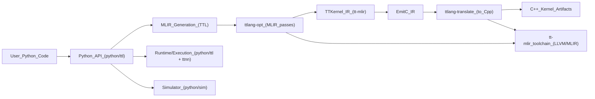
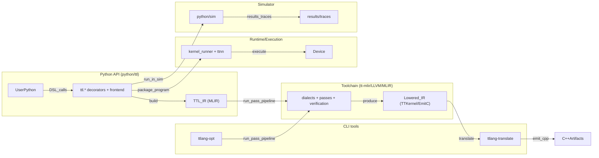
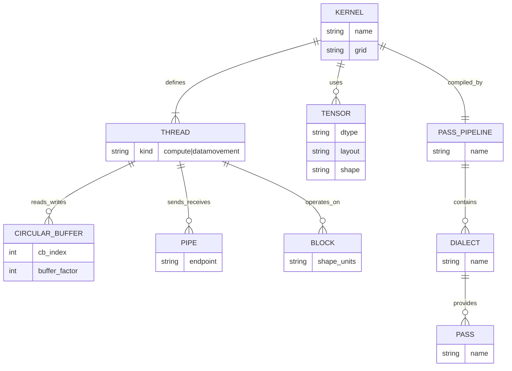
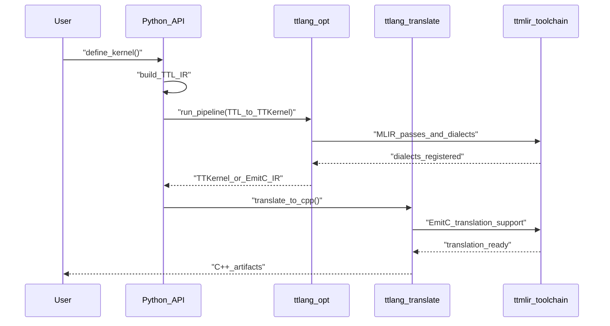
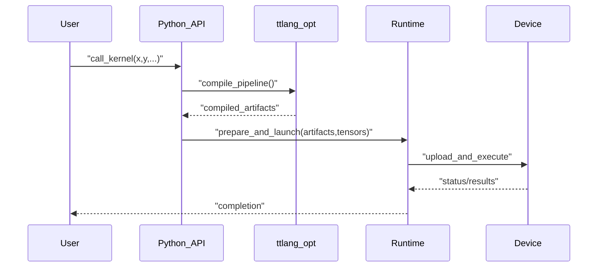
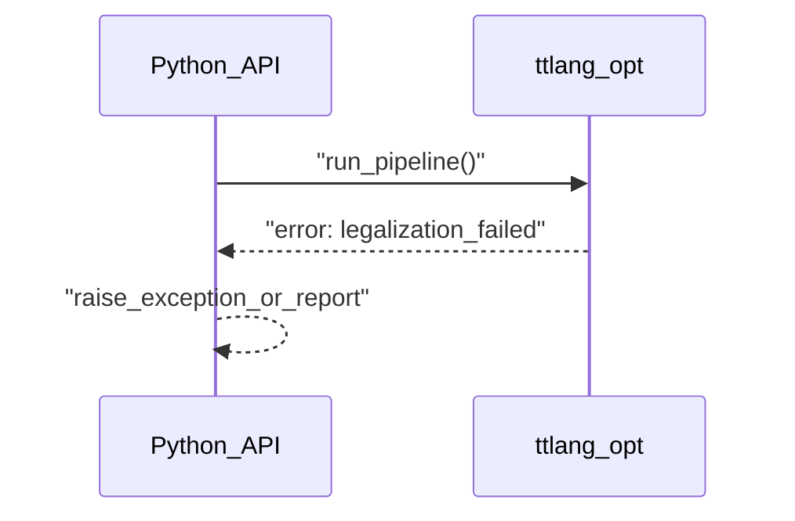
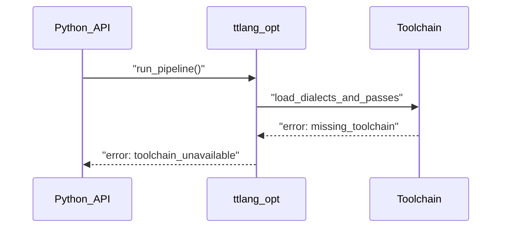

# Архитектура TT-Lang — Высокоуровневый дизайн (HLD)

## 0. Метаданные

- **Статус**: Актуально (HLD, "источник истины" для текущей архитектуры).
- **Аудитория**:
  - разработка компилятора/пайплайнов (tt-lang + tt-mlir),
  - разработка Python API / runtime-интеграции,
  - инженеры, которые пишут/отлаживают kernels на DSL.
- **Не-цели (non-goals)**:
  - полный справочник по CLI флагам и всем pass'ам (это в LLD),
  - подробные руководства по сборке/тестам (это в `docs/BUILD_SYSTEM.md` и `test/TESTING.md`),
  - описание TT-metal как продукта (tt-lang лишь интегрируется с ним через toolchain и runtime).
- **Связанные документы**:
  - `docs/sdlc/00_Main/02_Architecture/02_LLD_CompilerPipeline.md`
  - `docs/sdlc/00_Main/02_Architecture/03_LLD_RuntimeAndPythonAPI.md`
  - `docs/sdlc/00_Main/02_Architecture/04_LLD_Simulator.md`
  - `docs/sdlc/00_Main/02_Architecture/05_LLD_Testing.md`
  - `docs/sdlc/00_Main/02_Architecture/06_LLD_BuildSystem.md`
  - `docs/sdlc/00_Main/02_Architecture/07_LLD_LayeredIR_TTMetal_LLkDbV2_Validation.md` (proposal)
  - Языковая спецификация: `docs/sphinx/specs/TTLangSpecification.md`

## 1. Цель и область

Этот документ — **источник истины** для архитектуры `tt-lang`.
Он фиксирует:

- какие крупные компоненты существуют,
- как они взаимодействуют,
- какие “публичные” интерфейсы поддерживаются (CLI / Python API / C API),
- какие основные потоки выполнения и какие типовые ошибки ожидаемы.

Низкоуровневая детализация (LLD) должна быть **производной** от этого HLD и ссылаться на конкретные исходники.

### 1.1 Ключевые инварианты (что система обязана обеспечивать)

- **Детерминизм компиляции**: одинаковые входы (исходный Python + настройки + target) должны давать одинаковые артефакты компиляции.
- **Наблюдаемость**: должен существовать прямой путь получить промежуточные IR/diagnostics для воспроизводимой отладки.
- **Ясные границы ответственности**:
  - Python слой отвечает за DSL и UX (валидация, сообщения, удобные точки входа),
  - MLIR слой (tt-mlir/LLVM) отвечает за преобразования, верификацию и легализацию IR,
  - runtime отвечает за подготовку данных/артефактов и запуск на устройстве или в симуляции.
- **Отсутствие "тихих" фолбеков**: при несовместимости (toolchain/target/runtime) ожидание - явная ошибка.

## 2. Краткий обзор системы (L0)

TT‑Lang — Python DSL, который компилирует kernel‑код в MLIR и далее в низкоуровневые представления, пригодные для генерации C++/запуска на железе или симуляции.

## 3. Границы ответственности (component ownership)

Ниже фиксируются "владельцы" и "не-владельцы" поведения. Это важно, чтобы изменения не "расползались" между слоями.

| Компонент | Отвечает за | Не отвечает за | Основные входы/выходы |
|---|---|---|---|
| Python API (`python/ttl/*`) | DSL, декораторы, сбор thread-функций, формирование TTL IR, пользовательские diagnostics, интеграция с `ttnn` | Оптимизации/легализация IR, печать C++ как продукта | Вход: Python AST/функции, `ttnn.Tensor`. Выход: TTL IR, артефакты запуска |
| CLI driver `ttlang-opt` | Запуск MLIR pass/pipeline над MLIR | Семантика DSL, runtime-интеграция | Вход: MLIR файл. Выход: MLIR файл |
| CLI driver `ttlang-translate` | Трансляции/эмиссия (например TTKernel -> C++) | Выбор pipeline, валидация DSL | Вход: MLIR файл. Выход: текст/артефакты |
| Toolchain (tt-mlir/LLVM/MLIR) | Диалекты, passes, верификация, легализация, конверсии | Python UX, управление устройством | Вход: MLIR module. Выход: преобразованный MLIR/diagnostics |
| Runtime/Execution (`python/ttl/kernel_runner.py` + `ttnn`) | Подготовка и запуск на устройстве, маппинг аргументов/CB/ядра, управление кэшем артефактов | Оптимизации IR, форматирование diagnostics | Вход: артефакты компиляции, tensors. Выход: выполнение/статусы |
| Simulator (`python/sim/*`) | Моделирование исполнения без железа (в заданных границах) | Cycle-accurate модель всего чипа (если не заявлено) | Вход: логические артефакты/сценарии. Выход: результаты/трассы |

Ниже — та же информация в виде диаграммы потоков и границ ответственности:

## 4. Основные сущности (Concept / ER)

Ниже — “концептуальная ER‑карта” (не БД): какие сущности существуют и как связаны.

## 5. Публичные интерфейсы (CLI / Python / C API)

В tt‑lang есть несколько публичных “API поверхностей”:

1) CLI инструменты (`ttlang-opt`, `ttlang-translate`)
2) Python API (`python/ttl/*`) для декларации, компиляции и запуска
3) C API (`include/ttlang-c/*`) для интеграции

### 5.1 CLI интерфейсы (архитектурные гарантии)

| Интерфейс | Назначение | Входы | Выходы | Ошибки |
|---|---|---|---|---|
| `ttlang-opt` | Прогон MLIR pass/pipeline | MLIR файл + флаги/pipeline | MLIR файл (промежуточный) | неверный IR, не удалось легализовать ops, отсутствует toolchain |
| `ttlang-translate` | Трансляция (например TTKernel/EmitC -> C++) | MLIR файл + режим трансляции | C++ артефакты/текст | неподдерживаемый op, ошибка трансляции, несовместимый IR |

**Точки входа в исходниках**:

- `ttlang-opt`: `tools/ttlang-opt/ttlang-opt.cpp` (регистрация диалектов/passes/pipelines, затем `MlirOptMain`).
- `ttlang-translate`: `tools/ttlang-translate/ttlang-translate.cpp` (регистрация переводчиков, затем `mlirTranslateMain`).

Примечание: конкретные флаги/пайплайны документируются в LLD (с привязкой к `lib/Dialect/.../Pipelines/*`).

**Примеры вызова (аргументы/выходы CLI):**

| Сценарий | Команда | Выходы | Сигнал ошибки |
|---|---|---|---|
| TTL -> TTKernel | `ttlang-opt --ttl-to-ttkernel-pipeline --canonicalize input.mlir -o out.ttkernel.mlir` | `out.ttkernel.mlir` | exit code != 0, diagnostics в stderr |
| TTL -> EmitC (встроенно в pipeline) | `ttlang-opt --ttl-to-ttkernel-pipeline="lower-to-emitc=1" input.mlir -o out.emitc.mlir` | `out.emitc.mlir` | exit code != 0 |
| EmitC/TTKernel -> C++ | `ttlang-translate --ttkernel-to-cpp -o out.cpp out.emitc.mlir` | `out.cpp` | exit code != 0 |

### 5.2 Python API (архитектурные точки входа)

Пакет экспортирует DSL API на верхнем уровне, чтобы работало `import ttl; ttl.kernel`.

- Экспортируемые имена: `python/ttl/__init__.py`
- Объединяющий namespace `ttl.*`: `python/ttl/ttl.py`
- Основная реализация декораторов/компиляции: `python/ttl/ttl_api.py`

**Ключевые декораторы**:

- `ttl.kernel()` (фактически алиас на `pykernel_gen`): объявление kernel-функции и сбор вложенных thread-функций.
- `ttl.compute()`: объявление compute thread; автоматически регистрируется для компиляции kernel.
- `ttl.datamovement()`: объявление data movement thread; автоматически регистрируется для компиляции kernel.

**Наблюдаемость и отладка (в текущей реализации)**:

- Python-side verbose вывод: параметр `verbose` у декораторов `ttl.compute(verbose=...)` / `ttl.datamovement(verbose=...)` (см. `python/ttl/ttl_api.py`).
- Переменные окружения (читаются напрямую из `os.environ` в `python/ttl/ttl_api.py`):
  - `TTLANG_COMPILE_ONLY=1`: компилировать, но не выполнять.
  - `TTLANG_DEBUG_LOCATIONS=1`: печатать locations в MLIR output.
  - `TTLANG_INITIAL_MLIR=/path`: сохранить начальный IR.
  - `TTLANG_FINAL_MLIR=/path`: сохранить финальный IR.
  - `TTLANG_VERBOSE_PASSES=1` (или непусто): печать IR до/после passes.
- MLIR трассировка примеров и ожиданий по структуре IR: `docs/LOWERING_MULTITILE.md`.
- CLI: `ttlang-opt` и `ttlang-translate` позволяют воспроизводимо прогнать pipeline и увидеть diagnostics на входном MLIR.

| API | Назначение | Входы | Выходы | Ошибки |
|---|---|---|---|---|
| `@ttl.kernel()` | Объявление kernel‑функции | Python функция + сигнатуры тензоров | callable объект | ошибки ограничений DSL, ошибки типизации/внутренней валидации |
| `@ttl.compute()` / `@ttl.datamovement()` | Объявление потоков | Python функция | thread‑функция | нарушение ограничений, неподдерживаемые конструкции |
| runtime execute | Запуск на устройстве | тензоры, grid, параметры | выполнение/результаты | устройство недоступно, runtime ошибки, несовместимые layout/shape |
| simulator execute | Запуск в симуляторе | те же логические входы | симулированные результаты/трассы | ограничения симулятора, несовпадение моделей |

### 5.3 C API

C API является отдельной "поверхностью" для интеграции без Python. В HLD фиксируется только факт существования и область ответственности; детали типов/handle'ов должны быть задокументированы в LLD рядом с `include/ttlang-c/*`.

| API | Назначение | Входы | Выходы | Ошибки |
|---|---|---|---|---|
| `ttlang-c` | Интеграция без Python | handle’ы, атрибуты, IR | статусы, созданные объекты | статус‑коды/ошибки биндинга |

## 6. Основные потоки (sequence diagrams)

### 6.1 Compile-only (Python -> C++ артефакты)

### 6.2 Run (compile + execute)

### 6.3 Ошибочные потоки (типовые) и где искать причину

Цель этой секции - не перечислить все возможные ошибки, а дать устойчивую классификацию:

- **Ошибка уровня Python/DSL**: пользователь использовал неподдерживаемую конструкцию или нарушил ограничения DSL. Источник истины по формату сообщений: `python/ttl/diagnostics.py`.
- **Ошибка уровня MLIR (верификация/легализация)**: PassManager вернул failure или в stderr есть diagnostics от verifier/конверсий. Основной контекст: `ttlang-opt` / `python/ttl/ttl_api.py` (запуск pass pipeline) и LLD `02_LLD_CompilerPipeline.md`.
- **Ошибка трансляции (TTKernel/EmitC -> C++)**: переводчик не поддерживает op/атрибуты. См. `ttlang-translate` + соответствующие тесты трансляции.
- **Ошибка runtime/устройства**: проблема подготовки/запуска (`ttnn` недоступен, несовместимые layouts/shapes, устройство недоступно). См. `python/ttl/kernel_runner.py` и LLD `03_LLD_RuntimeAndPythonAPI.md`.

#### Ошибка 1: неверный/нелегальный IR

#### Ошибка 2: отсутствует toolchain / несовместимая сборка

## 7. Стабильность API и совместимость (policy)

Этот раздел фиксирует ожидания по стабильности и позволяет безопасно развивать систему.

- **Строго стабильное** (ожидается обратная совместимость):
  - базовый импорт/namespace `ttl.*` и наличие базовых декораторов (`ttl.kernel`, `ttl.compute`, `ttl.datamovement`);
  - базовый формат diagnostics и позиционирование ошибок по исходникам (`python/ttl/diagnostics.py`);
  - базовые debug knobs для воспроизводимости (`TTLANG_*` в `python/ttl/ttl_api.py`).
- **Условно стабильное** (может меняться при изменениях компилятора):
  - конкретные pipeline'ы и набор passes (имена в CLI сохраняются, содержимое может эволюционировать);
  - структура генерируемых C++ артефактов (пока нет обещания byte-идентичности без отдельной политики).
- **Экспериментальное**:
  - новые диалекты/слои IR для дополнительных валидаций (см. proposal `07_LLD_*`).

## 8. Границы документа

Подробные детали по:

- пассам/пайплайнам,
- расположению кода,
- тестовой инфраструктуре,
- симулятору,
переносятся в LLD файлы в этой же директории.
